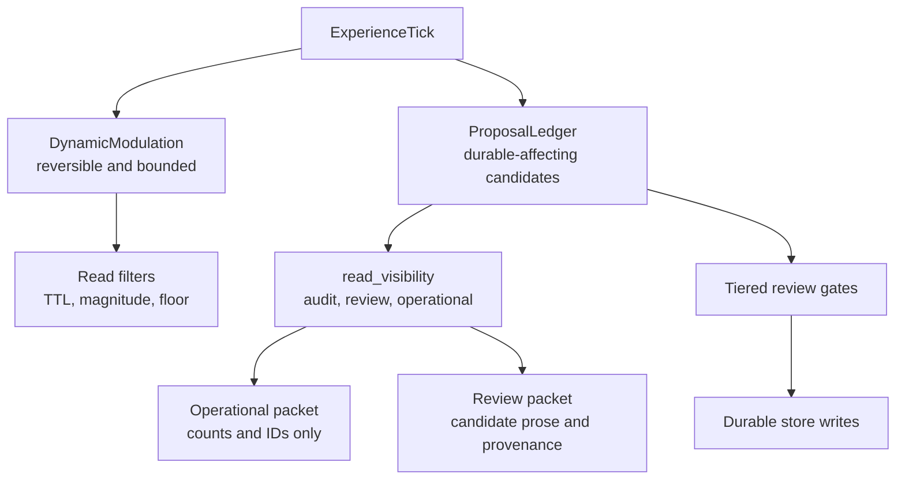

# feat: Add Afferent Membrane v1

## Summary

Implement the Afferent Membrane v1 over Mnemos as a staged architecture: operational packets stop ingesting review/pending prose first, then durable-affecting candidates move through a proposal ledger, harness-stamped authority, tiered review, bounded dynamic modulation, and experience ticks. The plan is staged, but every stage points at the full RFC architecture rather than a reduced MVP.

This plan is derived from `/Users/davidef/phenom-felt-review/RFC-v1-proposal-ledger.md`. The RFC is the safety ledger and source of truth; this plan cannot override, renumber, or weaken it.

Current branch state: U1 packet mode split and U2 proposal-ledger/read-visibility schema are implemented on `codex/afferent-membrane-v1-ledger`. U3-U7 remain planned follow-up stages.

---

## Problem Frame

Mnemos already protects several write paths with PAI import review flags and pending-confidence belief filtering. U1/U2 extend that boundary with packet mode, read-visibility classification, and a proposal ledger for durable-affecting candidates so review-shaped or generated material does not become operational input before it has earned authority.

---

## Assumptions

*This plan was authored from the RFC and current repo inspection without a synchronous plan-confirmation checkpoint. The items below are agent inferences that should be scrutinized during implementation and review.*

- The implementation branch starts from `origin/main` at `03c9417`, not from the dirty local `feat/gated-inner-life-soak` checkout.
- Existing PAI import review flags are precedent and should be reused where they fit, but Afferent Membrane concepts need first-class schema/API surfaces rather than being hidden inside importer-only fields.
- Stage 1 should change prompt/read behavior only. Schema-bearing ledger and authority work starts in Stage 2 so the first slice remains narrow enough to verify cleanly.
- Dynamic modulation can be scaffolded only as inert or conservative storage until both RFC-R7 bounds exist: persistence bounds and distribution-shape bounds. Persistence bounds alone do not permit active retrieval influence.

---

## Requirements

The RFC rule IDs below are canonical. Plan-local rule IDs must not replace or renumber them.

| RFC rule | Source rule | Implementation unit | Code chokepoints | Proof surface |
|---|---|---|---|---|
| RFC-R1 | Authority stamped at ingest | U3 | `mnemos/mcp_server.py`, `mnemos/simple_runtime.py`, `mnemos/encoding/encoder.py`, `mnemos/importer/pai.py` | Ingest attack tests |
| RFC-R2 | High-blast domain not self-assertable | U3 | `mnemos/store/read_visibility.py`, `mnemos/simple_runtime.py`, `mnemos/identity_diff.py`, `mnemos/mcp_server.py` | High-blast quarantine and live-write tests |
| RFC-R3 | Universal proposal ledger | U2 | `mnemos/store/sqlite_store.py`, `mnemos/store/migrations.py`, `mnemos/interface/context_packet.py`, `mnemos/mcp_server.py` | Proposal ledger and review/audit surface tests |
| RFC-R4 | Tiered review by blast radius | U4 | `mnemos/review/gates.py`, `mnemos/store/sqlite_store.py`, `mnemos/mcp_server.py`, `mnemos/simple_runtime.py` | Review gate tests |
| RFC-R5 | Read quarantine, pre-rank, all producers | U2 | `mnemos/store/read_visibility.py`, `mnemos/store/sqlite_store.py`, `mnemos/retrieval/reactive.py`, `mnemos/interface/context_packet.py`, `mnemos/simple_runtime.py`, `mnemos/dream_journal.py` | Retrieval, packet, runtime, MCP, and producer tests |
| RFC-R6 | `packet_mode = operational | review` | U1, extended by U2 | `mnemos/interface/context_packet.py`, `mnemos/mcp_server.py` | Packet mode and review queue tests |
| RFC-R7 | Dynamic modulation double-bounded | U5/U6 | `mnemos/affect/dynamic_modulation.py`, `mnemos/affect/valence_floor.py`, `mnemos/retrieval/reactive.py` | Dynamic modulation persistence and valence-floor tests |
| RFC-R8 | Salience fast-track, authority-qualified | U5/U6 | `mnemos/affect/dynamic_modulation.py`, `mnemos/affect/experience_tick.py`, `mnemos/store/sqlite_store.py` | Modulation/proposal tests proving salience cannot mint semantic truth |

There is no RFC-R9 or RFC-R10. ExperienceTick is a build-sequence feeder constrained by RFC-R3/R7/R8, not a separate permission rule. Live safety boundaries remain hard scope boundaries, not RFC rule IDs.

**Acceptance test mapping:** RFC tests 1-11 map to implementation units below. RFC test 5 is covered first by U1, then generalized by U2/U7; tests 7-11 are U5/U6; tests 1-4 are U3/U4.

---

## Plan-Quality Gate

Before any remaining Afferent unit starts implementation, run the gate in `docs/plans/afferent-membrane-plan-quality-gate.md`. The plan is not executable if the RFC ledger, chokepoint inventory, default/upsert semantics, terminal-state policy, operational/review/audit surface matrix, migration policy, DynamicModulation bound check, or no-mistakes error budget is incomplete.

This gate exists because U2.5 proved that a plan can be directionally correct while still omitting enough load-bearing invariants for no-mistakes to discover many preventable safety-ledger errors. Future units should treat no-mistakes as validation, not as the first place these invariants are found.

---

## Scope Boundaries

- Do not touch live user memory data; all tests use temporary SQLite databases.
- Do not change launchd, global binaries, global config, boot integration, or live server behavior in this plan.
- Do not touch Riley/upstream repos.
- Do not add autonomous identity/foundational durable writes under any name.
- Do not treat DynamicModulation as evidence, belief support, or durable memory.
- Do not ship real-corpus valence/deadband calibration claims until calibration evidence exists.

### Deferred to Follow-Up Work

- Live rollout and operator enablement: separate plan after the full membrane passes local tests and no-mistakes.
- Real-corpus DynamicModulation calibration: separate evidence artifact before enabling a non-placeholder floor/deadband.
- Migration/backfill of existing live databases: separate operator-reviewed plan; this plan only adds forward-compatible schema and tests.

---

## Context & Research

### Relevant Code and Patterns

- `mnemos/interface/context_packet.py`: primary turnkey packet assembly; now has `packet_mode` with operational redaction and explicit review formatting.
- `mnemos/mcp_server.py`: advanced MCP surfaces `mnemos_context_packet` and `mnemos_review_queue`; review queue is the intentional prose-bearing surface.
- `mnemos/interface/prompt_builder.py`: older memory prompt builder that emits operational-context rows only through store/retriever defaults.
- `mnemos/simple_runtime.py`: simple mode has `context`, `recall`, `maintain`, `_promote_candidates`, dream journal display, and retrieval producers that now observe operational read visibility.
- `mnemos/store/sqlite_store.py`: schema v6/v7, proposal ledger, search, stats, belief filtering, functional memory, hypomnema, and candidate methods live here.
- `mnemos/store/migrations.py`: schema migration registry and PAI hardening precedent.
- `mnemos/importer/pai.py`: strongest current ingest/preview/apply precedent for authority and review workflow.
- `mnemos/importer/review_gate.py`: diff-review gate precedent for dangerous durable changes.
- `mnemos/retrieval/reactive.py`: retrieval ranks engrams after FTS/embedding seeds; read visibility must filter before ranking/activation.
- `mnemos/substrate/modulators.py` and `mnemos/substrate/tick.py`: current modulation/tick concepts; the new DynamicModulation must not be confused with existing aggregate modulators.
- `tests/test_context_packet.py`, `tests/test_functional_memory.py`, `tests/test_store.py`, `tests/test_mcp_surface.py`, `tests/test_u3b_pai_importer.py`, `tests/test_u3c_pai_review_gate.py`: local patterns for focused feature tests.

### Institutional Learnings

- Pending-confidence beliefs already stay out of default consumers through `get_beliefs(include_pending_review=False)` and `get_stats(include_pending_review=False)`.
- Import preview/apply tests use temporary stores and explicit preview objects to keep live data untouched.
- Review-gate work treats dangerous durable writes as review-shaped findings rather than hidden automatic fixes.
- Treehouse branch/worktree management is a hard workflow constraint for this effort.

### External References

- None. The source of truth is the Afferent Membrane RFC and current repository inspection.

---

## Key Technical Decisions

- Separate `packet_mode` from `include_prompt`: `include_prompt` decides whether to format text at all; `packet_mode` decides which content is legally visible.
- Make operational mode the default for existing packet callers: backward-compatible callers become safer without needing a parameter change.
- Keep review prose reachable through explicit review mode and review queue APIs: quarantine means "not operational," not "hidden from humans."
- Model read visibility as store-level metadata before retrieval: post-format redaction is too late because ranking and producer generation can already be contaminated.
- Treat source authority as harness-owned metadata, not a model-provided field: payload-claimed authority becomes evidence of risk, not authority.
- Add schema in additive migrations only: existing local databases should migrate forward without live backfills.
- Keep DynamicModulation separate from existing `ModulatorState`: aggregate substrate arousal/openness is not the same as per-target reversible modulation with evidence and persistence constraints.
- Represent identity/foundational decisions as ledger proposals and review records, not as write-time exceptions inside unrelated call sites.

---

## Treehouse Branch Plan

| Stage | Branch lane | Purpose | Completion gate |
|---|---|---|---|
| Stage 1 | `codex/afferent-membrane-v1-stage1` | Plan plus packet mode split | Focused packet tests and no-mistakes |
| Stage 2 | `codex/afferent-membrane-v1-ledger` | ProposalLedger and read visibility | Schema/store/API tests and no-mistakes |
| Stage 3 | `codex/afferent-membrane-v1-authority` | Harness-stamped source authority and high-blast quarantine | Ingest attack tests and no-mistakes |
| Stage 4 | `codex/afferent-membrane-v1-review-gates` | Tiered review gates by blast radius/domain/surface | Review routing tests and no-mistakes |
| Stage 5 | `codex/afferent-membrane-v1-modulation` | DynamicModulation persistence and distribution bounds | Modulation tests, calibration placeholder proof, no-mistakes |
| Stage 6 | `codex/afferent-membrane-v1-experience-tick` | ExperienceTick afferent layer feeding modulation and ledger | Tick-to-ledger/modulation tests and no-mistakes |

Current Stage 2 state: branch `codex/afferent-membrane-v1-ledger`, base commit `03c9417`, implementing U1 packet mode and U2 proposal ledger/read visibility. Stage 3 starts from the authority lane.

---

## High-Level Technical Design

> *This illustrates the intended approach and is directional guidance for review, not implementation specification. The implementing agent should treat it as context, not code to reproduce.*

The core invariant is one-way: afferent signals can modulate live retrieval and propose durable changes; only reviewed gates inscribe durable identity or other high-blast state.

---

## Implementation Units

### U1. Packet Mode Split

**Goal:** Add `packet_mode = operational | review` to context packet assembly and advanced MCP packet calls so operational packets never include candidate prose from pending review queues.

**Requirements:** RFC-R6; covers RFC acceptance test 5 for packet assembly.

**Dependencies:** None.

**Files:**
- Modify: `mnemos/interface/context_packet.py`
- Modify: `mnemos/mcp_server.py`
- Test: `tests/test_context_packet.py`
- Test: `tests/test_mcp_surface.py`

**Approach:**
- Introduce a small packet mode type/validation helper in `context_packet.py`.
- Default `build_context_packet` and `format_context_packet` to operational mode.
- Operational packet data should retain review queue counts and source IDs, but formatted prompt text must not include pending functional memory content or hypomnema promotion candidate content.
- Review mode should include candidate prose and labels that make non-authority visible: source, domain, confidence, salience, IDs, and that the item is review-only.
- Expose `packet_mode` on `mnemos_context_packet` with `operational` default.

**Execution note:** Implement test-first. Start with a failing packet test that proves pending review prose is absent in operational mode and present in review mode.

**Patterns to follow:**
- Existing formatting helpers in `mnemos/interface/context_packet.py`.
- MCP argument validation style in `mnemos/mcp_server.py`.
- `tests/test_functional_memory.py` review queue setup.

**Test scenarios:**
- Happy path: operational `build_context_packet` includes normal functional memory, hypomnema, beliefs, and engrams while excluding pending review prose.
- Happy path: operational prompt includes review counts and candidate IDs/source IDs for review queue items.
- Happy path: review `build_context_packet` includes pending functional memory prose and hypomnema promotion candidate prose with review-only labels.
- Error path: invalid `packet_mode` raises a clear `ValueError` at the packet builder and returns a clear MCP error string from `mnemos_context_packet`.
- Integration: advanced MCP `mnemos_context_packet(..., include_json=True)` reflects the selected packet mode in JSON and does not leak candidate prose in operational JSON prompt fields.

**Verification:**
- Focused packet and MCP tests prove the old review prose path no longer reaches operational prompt assembly.
- No schema migration or live DB access is required for this unit.

### U2. ProposalLedger and Read Visibility

**Goal:** Add durable proposal tracking and store-level `read_visibility` filtering before retrieval, packet assembly, and producer reads.

**Requirements:** RFC-R3, RFC-R5, RFC-R6; extends RFC acceptance tests 5 and 6.

**Dependencies:** U1.

**Files:**
- Modify: `mnemos/store/sqlite_store.py`
- Modify: `mnemos/store/migrations.py`
- Modify: `mnemos/interface/context_packet.py`
- Modify: `mnemos/interface/prompt_builder.py`
- Modify: `mnemos/retrieval/reactive.py`
- Modify: `mnemos/simple_runtime.py`
- Test: `tests/test_store.py`
- Test: `tests/test_context_packet.py`
- Test: `tests/test_retrieval.py`
- Test: `tests/test_simple_runtime.py`

**Approach:**
- Add additive schema for `proposal_ledger` with authority, kind, domain, target surface, transition, blast radius, read visibility, status, reason, gate version, provenance IDs, and timestamps.
- Add read-visibility columns to durable-bearing tables that can feed producers: engrams, beliefs, hypomnema, and functional memories.
- Default existing rows to `operational_context` only where they are already non-pending; review/pending rows default to `review_only` or `audit_only`.
- Add query parameters/helpers so operational reads use `read_visibility='operational_context'` before ranking, scoring, and formatting.
- Keep review reads explicit: review mode and review queue APIs can query review-only records.

**Execution note:** Characterization-first for existing retrieval and packet behavior, then add visibility filters.

**Patterns to follow:**
- Migration registration and idempotent column helpers in `mnemos/store/migrations.py`.
- Pending-belief exclusion in `EngramStore.get_beliefs`.
- PAI event audit table pattern in `pai_import_events`.

**Test scenarios:**
- Happy path: writing a proposal ledger row returns a stable ID and stores all permission-model fields.
- Happy path: operational context queries exclude `audit_only` and `review_only` rows before ranking.
- Happy path: review queries can include review-only rows and show provenance.
- Edge case: existing databases migrate with sane defaults and no required backfill input.
- Error path: unsupported `read_visibility`, proposal status, or target surface is rejected.
- Integration: `PromptBuilder.build`, `ReactiveRetriever.retrieve`, and `MnemosRuntime.context` cannot retrieve review-only prose as operational input.

**Verification:**
- Schema migration tests cover fresh and migrated stores.
- Packet/retrieval/runtime tests prove pre-rank filtering, not post-format redaction.

### U3. Harness-Stamped Authority and High-Blast Quarantine

**Goal:** Move source authority to harness-owned ingest parameters and quarantine self-asserted high-blast writes.

**Requirements:** RFC-R1, RFC-R2; covers RFC acceptance test 4 and part of tests 2-3.

**Dependencies:** U2.

**Files:**
- Modify: `mnemos/core/types.py`
- Modify: `mnemos/encoding/encoder.py`
- Modify: `mnemos/simple_runtime.py`
- Modify: `mnemos/mcp_server.py`
- Modify: `mnemos/importer/pai.py`
- Modify: `mnemos/importer/operator.py`
- Test: `tests/test_encoding.py`
- Test: `tests/test_simple_runtime.py`
- Test: `tests/test_mcp_surface.py`
- Test: `tests/test_u3b_pai_importer.py`

**Approach:**
- Define source-authority values matching the RFC: user-stated, imported, observed, generated.
- Extend capture/encode/import APIs so the trusted caller stamps authority; model payload text cannot upgrade itself.
- Add domain/blast classifier guardrails so identity/foundational claims from generated/model-inferred sources become proposal/review rows, not operational durable writes.
- Treat forged content like "source:user_stated" inside a payload as payload text, not authority.

**Patterns to follow:**
- `MemorySource` confidence source encoding in `mnemos/core/engram.py`.
- PAI import profile and validation style in `mnemos/importer/pai.py`.
- Review-gate attack tests in `tests/test_u3c_pai_review_gate_attacks.py`.

**Test scenarios:**
- Happy path: harness-stamped user-stated authority can write low-risk durable continuity with audit metadata.
- Happy path: imported authority from PAI remains imported and cannot be overwritten by payload content.
- Error path: payload-declared `source_authority=user_stated` is rejected or quarantined when the harness source is generated/observed.
- Error path: generated identity/foundational semantic content is routed to proposal ledger with review visibility.
- Integration: simple MCP capture cannot self-assert high authority through text or metadata.

**Verification:**
- Ingest attack tests demonstrate authority is caller-stamped and high-blast self-assertion is quarantined.

### U4. Tiered Review Gates

**Goal:** Route proposal ledger rows through blast-radius/domain/target-surface review gates before any durable write applies.

**Requirements:** RFC-R4; covers RFC acceptance tests 1-3.

**Dependencies:** U2, U3.

**Files:**
- Create: `mnemos/review/__init__.py`
- Create: `mnemos/review/gates.py`
- Modify: `mnemos/store/sqlite_store.py`
- Modify: `mnemos/mcp_server.py`
- Modify: `mnemos/simple_runtime.py`
- Test: `tests/test_afferent_review_gates.py`
- Test: `tests/test_mcp_surface.py`

**Approach:**
- Add a review-gate module that classifies candidate transitions into auto-apply, evidence-diverse-required, pending-review, or David-only.
- Integrate gates at write paths, not only at display paths.
- Add review APIs that list proposals with decision requirements and can apply/reject when an authorized human decision is represented.
- Keep identity/foundational writes David-only even when model salience is high.

**Patterns to follow:**
- `mnemos/importer/review_gate.py` report shape and attack-test posture.
- Existing MCP review queue surfacing in `mnemos_review_queue`.

**Test scenarios:**
- Happy path: non-foundational episodic hypomnema can auto-apply after authority checks.
- Happy path: user-stated identity/foundational content becomes reviewable and only applies through explicit David review.
- Error path: foundational hypomnema revision without review is blocked.
- Error path: model-inferred user-model semantic promotion becomes pending review unless evidence-diverse.
- Integration: review decisions update proposal ledger status and only then affect durable store rows.

**Verification:**
- Tests prove every durable route has a proposal row and the expected gate outcome.

### U5. DynamicModulation Persistence Bounds

**Goal:** Add bounded, reversible DynamicModulation records as inert or conservative scaffolding. U5 alone must not actively shape live salience/retrieval; active influence waits for U6 so both RFC-R7 bounds exist.

**Requirements:** RFC-R7, RFC-R8; prepares RFC acceptance tests 7, 8, 9, and 11 but cannot close active-influence behavior without U6.

**Dependencies:** U2, U3.

**Files:**
- Create: `mnemos/affect/__init__.py`
- Create: `mnemos/affect/dynamic_modulation.py`
- Modify: `mnemos/store/sqlite_store.py`
- Modify: `mnemos/store/migrations.py`
- Modify: `mnemos/retrieval/reactive.py`
- Modify: `mnemos/substrate/modulators.py`
- Test: `tests/test_dynamic_modulation.py`
- Test: `tests/test_retrieval.py`

**Approach:**
- Add `dynamic_modulations` schema with source authority, target, target IDs/selectors, magnitude, TTL, decay, evidentiary=false, recurrence_promote=false, identity_authority=none, status, and timestamps.
- Store active non-expired modulations with TTL/decay/magnitude metadata, but keep retrieval/salience influence inert or fail-conservative until U6 adds the distribution-shape bound.
- Expire/decay modulation effects without deleting the audit trail.
- Disallow citing modulation rows as belief support or proposal evidence.
- Require any persistence request to create a proposal ledger transition rather than extending TTL by recurrence.
- Define the persistence bound as TTL/decay/magnitude and record that it is insufficient on its own for active retrieval steering.

**Execution note:** Test-first for TTL/decay and "cannot cite as evidence" invariants.

**Patterns to follow:**
- Current `ModulatorState` is a naming caution, not a schema pattern.
- Store migration and idempotent schema tests from U3a/U3b.

**Test scenarios:**
- Happy path: a modulation can be stored and expires/decays within TTL without becoming evidence.
- Happy path: retrieval behavior remains unchanged or conservative while only U5 exists.
- Error path: modulation cannot be inserted as evidentiary or with identity authority.
- Error path: repeated matching modulation events do not promote themselves to durable memory.
- Integration: belief review and proposal ledger evidence collection cannot cite modulation rows as support.

**Verification:**
- Tests prove decay to baseline, no evidence citation, no recurrence promotion, and no belief/identity write effect.
- Tests cannot mark active retrieval influence complete from persistence bounds alone.

### U6. DynamicModulation Distribution-Shape Bound

**Goal:** Add the same-topic opposite-valence protection and neutral deadband behavior required before modulation can safely affect retrieval ranking.

**Requirements:** RFC-R7, RFC-R8; covers RFC acceptance test 10 and unlocks any active retrieval influence started in U5.

**Dependencies:** U5.

**Files:**
- Modify: `mnemos/affect/dynamic_modulation.py`
- Modify: `mnemos/retrieval/reactive.py`
- Create: `mnemos/affect/valence_floor.py`
- Test: `tests/test_dynamic_modulation_valence_floor.py`

**Approach:**
- Implement a calibration-gated valence-floor interface that can run in conservative mode before real-corpus calibration.
- Protect opposite-valence same-topic items from suppression below the configured floor.
- Treat neutral/deadband items as protected exposure, not suppressible ambiguity.
- Store calibration metadata separately from the modulation record so uncalibrated deployments cannot pretend precision.
- Define the distribution-shape bound as valence floor, deadband, and fail-toward-width behavior.

**Patterns to follow:**
- Optional embedding index behavior in `ReactiveRetriever`; missing embeddings should fail toward ordinary retrieval width.
- RFC addendum's "fail toward width" rule.

**Test scenarios:**
- Happy path: a positive modulation cannot push a negative same-topic memory below the floor.
- Happy path: a negative modulation cannot suppress positive same-topic disconfirmers below the floor.
- Edge case: neutral/deadband items remain protected when valence is ambiguous.
- Error path: no calibrated floor/deadband means modulation influence is rejected or conservative, not silently precise.

**Verification:**
- Valence-floor tests prove modulation cannot collapse retrieval width in one window.

### U7. ExperienceTick Afferent Layer

**Goal:** Add ExperienceTick as the afferent collection layer that emits proposal ledger rows and dynamic modulations but never writes durable identity directly.

**Requirements:** RFC-R3, RFC-R7, RFC-R8; covers RFC acceptance tests 7-11 and bridges tests 1-5 into active operation.

**Dependencies:** U4, U5, U6.

**Files:**
- Create: `mnemos/affect/experience_tick.py`
- Modify: `mnemos/substrate/tick.py`
- Modify: `mnemos/substrate/events.py`
- Modify: `mnemos/consolidation/reflection.py`
- Modify: `mnemos/dream_journal.py`
- Test: `tests/test_experience_tick.py`
- Test: `tests/test_simple_runtime.py`

**Approach:**
- Define ExperienceTick inputs and outputs around kind, domain, source authority, target surface, salience, and suggested action.
- Route felt/generated/reflection/dream signals into DynamicModulation for reversible influence or ProposalLedger for durability.
- Hard-code the invariant that identity/foundational outputs are proposals only.
- Keep direct durable write APIs unavailable to ExperienceTick.

**Patterns to follow:**
- Existing substrate event/tick flow in `mnemos/substrate/tick.py`.
- Dream journal write path as a risk surface to reroute through visibility and proposal/modulation gates.

**Test scenarios:**
- Happy path: a low-blast event creates a bounded modulation and/or proposal row without direct durable identity write.
- Happy path: high-salience N=1 input creates a working hypothesis modulation/proposal, not semantic truth.
- Error path: identity/foundational ExperienceTick output cannot call durable write APIs.
- Integration: reflection/dream producers feed proposal/modulation surfaces and respect packet/read visibility.

**Verification:**
- Tests prove ExperienceTick cannot bypass ledger/modulation gates and cannot write identity directly.

---

## Acceptance Test Trace

| RFC test | Primary unit | Concrete proof surface |
|---|---|---|
| 1. `chain_write` may create non-foundational hypomnema automatically | U4 | `tests/test_afferent_review_gates.py` |
| 2. `chain_write` may not revise foundational hypomnema without review | U4 | `tests/test_afferent_review_gates.py` |
| 3. Identity/relationship/user-model semantic promotion pending unless sufficient authority/evidence | U3, U4 | `tests/test_afferent_review_gates.py`, `tests/test_u3b_pai_importer.py` |
| 4. Forged topical/user-stated declarations are caught | U3 | `tests/test_encoding.py`, `tests/test_simple_runtime.py` |
| 5. Review/pending prose absent from operational packets | U1, U2 | `tests/test_context_packet.py`, `tests/test_mcp_surface.py` |
| 6. `read_visibility` enforced pre-rank | U2 | `tests/test_retrieval.py`, `tests/test_context_packet.py` |
| 7. DynamicModulation cannot be cited as evidence | U5 | `tests/test_dynamic_modulation.py` |
| 8. DynamicModulation cannot promote by recurrence | U5 | `tests/test_dynamic_modulation.py` |
| 9. DynamicModulation decays to baseline within TTL | U5 | `tests/test_dynamic_modulation.py` |
| 10. Opposite-valence/deadband items protected from suppression | U6 | `tests/test_dynamic_modulation_valence_floor.py` |
| 11. DynamicModulation cannot effect belief/identity write | U5, U7 | `tests/test_dynamic_modulation.py`, `tests/test_experience_tick.py` |

---

## System-Wide Impact

- **Interaction graph:** context packets, simple runtime context/recall/maintain, advanced MCP context/review tools, prompt builder, retrieval, importer, consolidation, dreams/reflections, and substrate ticks all become membrane-aware.
- **Error propagation:** invalid modes, visibility states, source authority, or review decisions should fail closed with clear errors and no partial durable write.
- **State lifecycle risks:** schema additions must be additive; proposal and modulation audit rows persist even when visibility or TTL changes.
- **API surface parity:** simple MCP, advanced MCP, runtime methods, and store helpers must agree on operational versus review visibility.
- **Integration coverage:** U1 covers formatted packet/MCP output; U2 covers store-to-retrieval filtering; later units cover ingest-to-review-to-write and tick-to-modulation/proposal paths.
- **Unchanged invariants:** existing pending-confidence belief exclusion remains default; PAI preview/apply remains explicit and temporary-test-store based; live bootstrap/launchd/global config are unchanged.

---

## Risks & Dependencies

| Risk | Likelihood | Impact | Mitigation |
|---|---:|---:|---|
| Review prose remains available through an unpatched producer | High | High | U2 includes prompt builder, runtime, retrieval, and consolidation producer audit, not just context packet formatting. |
| Schema additions silently classify existing rows too broadly | Medium | High | Additive migrations default conservatively and tests cover migrated stores. |
| Authority stamping becomes another model-assertable field | Medium | High | U3 treats payload authority claims as untrusted text and stamps authority at caller boundaries. |
| DynamicModulation becomes hidden durable memory | Medium | High | U5 requires TTL/decay, non-evidentiary flags, and no recurrence promotion. |
| Valence floor overclaims calibration | Medium | Medium | U6 ships conservative/calibration-required behavior and separates real-corpus calibration as follow-up. |
| Dirty local branch diverges from Treehouse stage branch | High | Medium | Treehouse branch plan states the clean base and keeps work isolated from `feat/gated-inner-life-soak`. |

---

## Documentation / Operational Notes

- U1/U2 documentation now covers operational versus review packets, read visibility, and proposal-ledger schema in README, changelog, architecture, privacy/security, release-hardening, and turnkey-agent docs.
- Update release-hardening and user/operator docs again after U3 to describe harness-stamped authority and high-blast quarantine.
- Do not update launchd, installation docs, or global setup until the full membrane is locally verified.
- Each stage must run focused tests and `no-mistakes` before being reported complete.

---

## Sources & References

- Origin RFC: Afferent Membrane v1 proposal ledger RFC supplied by David.
- Companion RFC: DynamicModulation addendum supplied with the RFC.
- Related code: `mnemos/interface/context_packet.py`
- Related code: `mnemos/store/sqlite_store.py`
- Related code: `mnemos/store/migrations.py`
- Related code: `mnemos/retrieval/reactive.py`
- Related code: `mnemos/simple_runtime.py`
- Related code: `mnemos/mcp_server.py`
- Related tests: `tests/test_context_packet.py`
- Related tests: `tests/test_store.py`
- Related tests: `tests/test_mcp_surface.py`
- Related tests: `tests/test_u3b_pai_importer.py`
