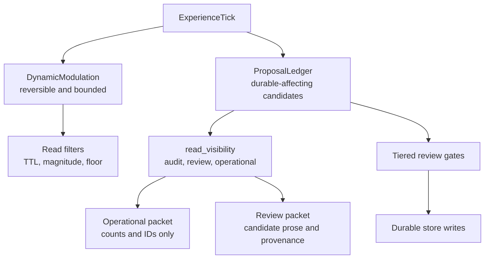

# feat: Add Afferent Membrane v1

## Summary

Implement the Afferent Membrane v1 over Mnemos as a staged architecture: operational packets stop ingesting review/pending prose first, then durable-affecting candidates move through a proposal ledger, harness-stamped authority, tiered review, bounded dynamic modulation, and experience ticks. The plan is staged, but every stage points at the full RFC architecture rather than a reduced MVP.

This plan is derived from `/Users/davidef/phenom-felt-review/RFC-v1-proposal-ledger.md`. The RFC is the safety ledger and source of truth; this plan cannot override, renumber, or weaken it.

Current branch state: U1 packet mode split and U2 proposal-ledger/read-visibility schema are implemented on `codex/afferent-membrane-v1-ledger`. U3 through U6b remain planned follow-up stages; U6c (dream graduation, Amendment B) is scheduled as a subsequent stage per its dependency line (AM-U6 live + accumulated dream corpus).

## Current Validation State

Validation snapshot, recorded 2026-07-01 before this ce-doc-review repair:

- Branch head inspected: `37613d7`.
- Active `no-mistakes` run: `01KWDGFPVZ89DWHK80EKBEFFC0` on branch `codex/afferent-membrane-v1-ledger`, head `f52fcf90`, PR `https://github.com/davidefitz/mnemos/pull/4`, status `ci: running`.
- Therefore Stage 2/U2.5 is not no-mistakes-covered at the inspected branch head.

Do not start U3 until `no-mistakes` passes for the same short SHA returned by `git rev-parse --short HEAD`. Recompute this block before authority-stamping work; stale validation snapshots are warnings, not clearance.

---

## Problem Frame

Mnemos already protects several write paths with PAI import review flags and pending-confidence belief filtering. U1/U2 extend that boundary with packet mode, read-visibility classification, and a proposal ledger for durable-affecting candidates so review-shaped or generated material does not become operational input before it has earned authority.

---

## Assumptions

*This plan was authored from the RFC and current repo inspection without a synchronous plan-confirmation checkpoint. The items below are agent inferences that should be scrutinized during implementation and review.*

- The implementation branch starts from `origin/main` at `03c9417`, not from the dirty local `feat/gated-inner-life-soak` checkout.
- Existing PAI import review flags are precedent and should be reused where they fit, but Afferent Membrane concepts need first-class schema/API surfaces rather than being hidden inside importer-only fields.
- Stage 1 should change prompt/read behavior only. Schema-bearing ledger and authority work starts in Stage 2 so the first slice remains narrow enough to verify cleanly.
- Dynamic modulation can be scaffolded only as inert or conservative storage until both RFC-R7 bounds exist: persistence bounds and distribution-shape bounds. Persistence bounds alone do not permit active retrieval influence.

---

## Requirements

The RFC rule IDs below are canonical. Plan-local rule IDs must not replace or renumber them.

| RFC rule | Source rule | Implementation unit | Code chokepoints | Proof surface |
|---|---|---|---|---|
| RFC-R1 | Authority stamped at ingest | U3 | `mnemos/mcp_server.py`, `mnemos/simple_runtime.py`, `mnemos/encoding/encoder.py`, `mnemos/importer/pai.py` | Ingest attack tests |
| RFC-R2 | High-blast domain not self-assertable | U3 | `mnemos/store/read_visibility.py`, `mnemos/simple_runtime.py`, `mnemos/identity_diff.py`, `mnemos/mcp_server.py` | High-blast quarantine and live-write tests |
| RFC-R3 | Universal proposal ledger | U2, extended by U6c (dream graduation) | `mnemos/store/sqlite_store.py`, `mnemos/store/migrations.py`, `mnemos/interface/context_packet.py`, `mnemos/mcp_server.py`, planned `mnemos/dream_patterns/pattern_store.py` | Proposal ledger and review/audit surface tests; dream-graduation proposal-emission tests (planned U6c) |
| RFC-R4 | Tiered review by blast radius | U4 (evidence-diversity definition per AM-U4 subsection) | `mnemos/review/gates.py`, `mnemos/store/sqlite_store.py`, `mnemos/mcp_server.py`, `mnemos/simple_runtime.py`, planned `mnemos/review/evidence_diversity.py`, planned `mnemos/review/consistency_anomaly.py` | Review gate tests; evidence-diversity qualification, consistency-anomaly review display, and false-consensus/single-instance negatives |
| RFC-R5 | Read quarantine, pre-rank, all producers | U2 | `mnemos/store/read_visibility.py`, `mnemos/store/sqlite_store.py`, `mnemos/retrieval/reactive.py`, `mnemos/interface/context_packet.py`, `mnemos/simple_runtime.py`, `mnemos/dream_journal.py` | Retrieval, packet, runtime, MCP, and producer tests |
| RFC-R6 | `packet_mode = operational | review` | U1, extended by U2 | `mnemos/interface/context_packet.py`, `mnemos/mcp_server.py` | Packet mode and review queue tests |
| RFC-R7 | Dynamic modulation double-bounded | U5/U6, extended by U6c (dream graduation) | `mnemos/affect/dynamic_modulation.py`, `mnemos/affect/valence_floor.py`, `mnemos/retrieval/reactive.py`, planned `mnemos/dream_patterns/pattern_store.py`, planned `mnemos/substrate/handlers/dreaming.py`, planned `mnemos/substrate/handlers/wandering.py` | Dynamic modulation persistence and valence-floor tests; dream-pattern adaptive-decay and non-accumulating-graduation tests |
| RFC-R8 | Salience fast-track, authority-qualified | U5/U6, extended by U6c (dream graduation) | `mnemos/affect/dynamic_modulation.py`, `mnemos/affect/experience_tick.py`, `mnemos/store/sqlite_store.py`, planned `mnemos/inner_life/narrative_gate.py`, planned `mnemos/dream_patterns/pattern_store.py` | Modulation/proposal tests proving salience cannot mint semantic truth; four-condition-conjunctive-gate and identity-domain-drop tests (planned U6c) |

There is no RFC-R9 or RFC-R10. ExperienceTick is a build-sequence feeder constrained by RFC-R3/R7/R8, not a separate permission rule. Live safety boundaries remain hard scope boundaries, not RFC rule IDs.

**Acceptance test mapping:** RFC tests 1-11 map to implementation units below. RFC test 5 is covered first by U1, then generalized by U2/U6; tests 7-11 are U5/U6; tests 1-4 are U3/U4.

---

## Plan-Quality Gate

Before any remaining Afferent unit starts implementation, run the gate in `docs/plans/afferent-membrane-plan-quality-gate.md`. The plan is not executable if the RFC ledger, chokepoint inventory, default/upsert semantics, terminal-state policy, operational/review/audit surface matrix, actor/auth policy, migration policy, DynamicModulation bound check, or no-mistakes error budget is incomplete.

This gate exists because U2.5 proved that a plan can be directionally correct while still omitting enough load-bearing invariants for no-mistakes to discover many preventable safety-ledger errors. Future units should treat no-mistakes as validation, not as the first place these invariants are found.

---

## Rule Ledger

This ledger is the plan's executable trace from RFC rule to unit, chokepoint, and tests. A future Afferent plan is not acceptable if it has orphan RFC rules, invented rule IDs, or "covered by X" claims that do not name a file/function/test surface.

| RFC rule | Implementation unit | Code chokepoints | Positive tests | Negative tests |
|---|---|---|---|---|
| RFC-R1 | U3 | `mnemos/mcp_server.py::mnemos_remember`, `mnemos/mcp_server.py::mnemos_ingest`, `mnemos/simple_runtime.py::MnemosRuntime.capture`, `mnemos/encoding/encoder.py::Encoder.encode`, `mnemos/importer/pai.py::apply_pai_import`, `mnemos/importer/pai.py::_write_target_row` | planned `tests/test_encoding.py::TestEncoder::test_ingest_stamps_harness_authority`; planned `tests/test_u3b_pai_importer.py::test_pai_import_preserves_imported_authority` | planned `tests/test_mcp_surface.py::test_mnemos_remember_rejects_forged_source_authority`; planned `tests/test_simple_runtime.py::test_generated_capture_cannot_self_upgrade_authority` |
| RFC-R2 | U3, with U2 pre-authority guardrails | `mnemos/store/read_visibility.py::classify_hypomnema_read_visibility`, `mnemos/store/sqlite_store.py::write_hypomnema_entry`, `mnemos/simple_runtime.py::MnemosRuntime.capture`, `mnemos/identity_diff.py`, `mnemos/mcp_server.py::mnemos_hypomnema_write` | `tests/test_hypomnema.py::TestHypomnemaStore::test_identity_or_foundational_hypomnema_defaults_review_only_even_below_promotion_threshold`; `tests/test_simple_runtime.py::test_capture_foundational_identity_note_is_review_only_and_not_promoted` | `tests/test_hypomnema.py::TestHypomnemaStore::test_explicit_operational_visibility_for_review_worthy_hypomnema_is_rejected`; `tests/test_mcp_surface.py::test_mcp_hypomnema_write_default_review_only_is_quarantined_from_search_candidates_promote_and_visible_in_review` |
| RFC-R3 | U2, extended by U6c (dream graduation) | `mnemos/store/sqlite_store.py::write_proposal`, `mnemos/store/sqlite_store.py::list_proposals`, `mnemos/store/sqlite_store.py::get_proposal`, `mnemos/store/migrations.py`, `mnemos/mcp_server.py::mnemos_review_queue`, `mnemos/mcp_server.py::mnemos_proposal_audit`, planned `mnemos/inner_life/low_stakes.py::graduate_dream_pattern`, planned `mnemos/dream_patterns/pattern_store.py::emit_graduation_proposal` | `tests/test_store.py::TestEngramStore::test_proposal_ledger_accepts_rfc_authority_and_kind_axes`; `tests/test_mcp_surface.py::test_review_queue_includes_review_only_proposal_rows_with_provenance`; planned `tests/test_dream_graduation.py::test_graduation_emits_ledger_row` | `tests/test_store.py::TestEngramStore::test_proposal_upsert_rejects_rejected_terminal_conflict`; `tests/test_store.py::TestEngramStore::test_proposal_upsert_rejects_applied_terminal_conflict`; `tests/test_mcp_surface.py::test_review_queue_excludes_terminal_review_only_proposals` |
| RFC-R4 | U4 (evidence-diversity definition per AM-U4 subsection) | planned `mnemos/review/gates.py::classify_review_requirement`, planned `mnemos/review/gates.py::apply_review_decision`, `mnemos/store/sqlite_store.py::write_proposal`, planned `mnemos/store/sqlite_store.py::apply_proposal_decision`, planned `mnemos/mcp_server.py::mnemos_proposal_decide`, planned `mnemos/review/evidence_diversity.py::compute_evidence_diversity`, planned `mnemos/review/consistency_anomaly.py::compute_consistency_anomaly` | planned `tests/test_afferent_review_gates.py::test_non_foundational_hypomnema_auto_applies_after_authority_checks`; planned `tests/test_afferent_review_gates.py::test_user_stated_foundational_identity_applies_only_after_david_review`; planned `tests/test_afferent_review_gates.py::test_evidence_diverse_support_qualifies_when_min_pairwise_dissimilarity_clears_threshold`; planned `tests/test_afferent_review_gates.py::test_consistency_anomaly_surfaces_without_decision_threshold` | planned `tests/test_afferent_review_gates.py::test_foundational_revision_without_review_is_blocked`; `tests/test_store.py::TestEngramStore::test_proposal_ledger_defaults_to_audit_only_and_rejects_pending_operational_visibility`; planned `tests/test_afferent_review_gates.py::test_paraphrase_variant_set_does_not_qualify_as_evidence_diverse`; planned `tests/test_afferent_review_gates.py::test_single_instance_or_incomputable_diversity_routes_to_review` |
| RFC-R5 | U2 | `mnemos/store/sqlite_store.py::get_active_engrams`, `mnemos/store/sqlite_store.py::search_fts`, `mnemos/store/sqlite_store.py::count_engrams`, `mnemos/retrieval/reactive.py::ReactiveRetriever.retrieve`, `mnemos/interface/context_packet.py::build_context_packet`, `mnemos/simple_runtime.py::MnemosRuntime.context`, `mnemos/dream_journal.py` tag readers | `tests/test_retrieval.py::TestReactiveRetriever::test_retrieval_excludes_review_only_fts_and_propagation`; `tests/test_context_packet.py::test_operational_context_packet_quarantines_review_prose`; `tests/test_store.py::TestEngramStore::test_count_engrams_defaults_to_operational_visibility` | `tests/test_retrieval.py::TestReactiveRetriever::test_review_and_audit_rows_do_not_seed_operational_retrieval`; `tests/test_visualization_data.py::test_dashboard_extracts_operational_visibility_by_default`; `tests/test_store.py::TestEngramStore::test_get_hypomnema_entries_by_tag_filters_read_visibility_by_default` |
| RFC-R6 | U1, extended by U2 | `mnemos/interface/context_packet.py::build_context_packet`, `mnemos/interface/context_packet.py::format_context_packet`, `mnemos/mcp_server.py::mnemos_context_packet`, `mnemos/mcp_server.py::mnemos_review_queue`, `mnemos/interface/visual_snapshot.py` | `tests/test_context_packet.py::test_review_context_packet_can_include_review_only_rows`; `tests/test_mcp_surface.py::test_review_queue_opts_into_review_candidate_prose` | `tests/test_context_packet.py::test_formatter_operational_override_redacts_existing_review_packet`; `tests/test_context_packet.py::test_formatter_review_override_rejects_redacted_operational_packet`; `tests/test_context_packet.py::test_operational_proposal_count_uses_total_not_limited_reference_sample` |
| RFC-R7 | U5/U6, extended by U6c (dream graduation) | planned `mnemos/affect/dynamic_modulation.py::store_modulation`, planned `mnemos/affect/dynamic_modulation.py::bounded_retrieval_adjustment`, planned `mnemos/affect/valence_floor.py::apply_valence_floor`, `mnemos/retrieval/reactive.py::ReactiveRetriever.retrieve`, planned `mnemos/store/sqlite_store.py::write_dynamic_modulation`, planned `mnemos/substrate/handlers/dreaming.py::apply_dream_pattern_match`, planned `mnemos/substrate/handlers/wandering.py::route_dream_output`, planned `mnemos/dream_patterns/pattern_store.py::adaptive_decay` | planned `tests/test_dynamic_modulation.py::test_modulation_decays_to_baseline_within_ttl`; planned `tests/test_dynamic_modulation_valence_floor.py::test_opposite_valence_same_topic_items_remain_above_floor`; planned `tests/test_dream_graduation.py::test_adaptive_decay_transitions_unrevisited_patterns_to_decayed_state_audit_only_retained` | planned `tests/test_dynamic_modulation.py::test_dynamic_modulation_cannot_be_cited_as_evidence`; planned `tests/test_dynamic_modulation.py::test_dynamic_modulation_cannot_promote_by_recurrence`; planned `tests/test_dynamic_modulation_valence_floor.py::test_deadband_items_fail_toward_width`; planned `tests/test_dream_graduation.py::test_graduation_is_non_accumulating`; planned `tests/test_dream_graduation.py::test_single_stabilized_pattern_emits_exactly_one_proposal` |
| RFC-R8 | U5/U6, extended by U6c (dream graduation) | planned `mnemos/affect/experience_tick.py::ExperienceTick`, planned `mnemos/affect/experience_tick.py::route_tick`, planned `mnemos/affect/dynamic_modulation.py::store_modulation`, `mnemos/store/sqlite_store.py::write_proposal`, `mnemos/retrieval/reactive.py::ReactiveRetriever.retrieve`, planned `mnemos/inner_life/narrative_gate.py::apply_high_blast_generated_drop`, planned `mnemos/dream_patterns/pattern_store.py::conjunctive_stabilization_gate` | planned `tests/test_experience_tick.py::test_salience_fast_track_emits_bounded_modulation_or_proposal`; planned `tests/test_dream_graduation.py::test_authentic_recurrence_graduates_at_generated_authority` | planned `tests/test_experience_tick.py::test_high_salience_single_tick_cannot_mint_semantic_truth`; planned `tests/test_dynamic_modulation.py::test_modulation_cannot_write_belief_or_identity`; planned `tests/test_dream_graduation.py::test_stabilization_requires_all_four_conjunctive_conditions`; planned `tests/test_dream_graduation.py::test_vividness_ratio_cap_blocks_single_instance_domination`; planned `tests/test_dream_graduation.py::test_identity_domain_dream_content_drops_at_narrative_gate_regardless_of_stability` |

---

## State Ledger

This ledger names durable object states, defaults, omitted-field behavior, upsert behavior, terminal states, allowed transitions, and rejected transitions. It exists so code cannot hide lifecycle policy in a helper or migration.

| Durable object | Allowed states / visibility | Defaults and omitted fields | Upsert behavior | Terminal states | Allowed transitions | Rejected transitions |
|---|---|---|---|---|---|---|
| Engram | `state=active/archived/forgotten`; `read_visibility=operational_context/review_only/audit_only` | New ordinary engrams default operational unless a trusted writer explicitly sets stricter visibility | Generic `save_engram` preserves or strengthens existing `read_visibility`; it must not downgrade review/audit rows to operational | `archived`, `forgotten` for ordinary reads | active operational reads; explicit reviewed promotion path may lower visibility only when implemented as a reviewed gate | default dataclass save cannot operationalize an existing review/audit engram; review/audit targets cannot be forgotten/inspected by ordinary MCP direct-ID tools |
| Belief | `needs_review`, `confidence_pending_review`, `read_visibility=operational_context/review_only/audit_only` | Imported/review-risk beliefs default review-only or audit-only; reviewed beliefs become operational through the reviewed path | Generic `save_belief` preserves stricter visibility and pending-review flags when effective visibility is non-operational | explicit reviewed promotion clears pending flags; audit-only stays quarantined unless a reviewed path changes it | `save_reviewed_belief` can intentionally promote after review; review flows may move operational rows to review-only | generic upsert cannot clear pending flags on review/audit rows; PAI re-import cannot downgrade audit-only to review-only |
| Functional memory | normal, `needs_confirmation`, `read_visibility=operational_context/review_only/audit_only` | Confirmation-needed rows are review-only unless explicitly confirmed; audit-only rows require audit/admin reads | Conflict/update keeps stricter visibility and confirmation state until confirmed | confirmed operational row; archived/removed confirmation records if later implemented | explicit confirmation path may move review-only confirmation into operational memory | ordinary packets, status counts, visual snapshots, and review queues cannot expose audit-only confirmation prose or IDs |
| Hypomnema entry | `active/superseded/promoted`; `read_visibility=operational_context/review_only/audit_only`; `domain`, `foundational`, `revision_count`, `promoted_to_engram_id` | Schema default is `operational_context`, but omitted live writes classify at write time. Promotion candidates and identity/foundational rows become `review_only` unless a trusted gate overrides | Omitted-visibility upsert preserves ordinary operational rows only while still ordinary; crossing promotion/high-blast thresholds strengthens to review-only. Explicit upsert cannot downgrade review/audit rows | `superseded`; promoted rows remain non-operational unless reviewed/promotion path permits | ordinary low-risk write -> operational; promotion/high-blast write -> review-only; supersede preserves or strengthens visibility | fresh high-confidence/foundational write cannot become operational; fresh promotion/high-blast write cannot become operational; duplicate upsert cannot promote by omission; explicit operational visibility for review-worthy row is rejected |
| ProposalLedger row | `status=pending_review/deferred/rejected/applied`; `read_visibility=review_only/audit_only` for non-terminal proposal review, never operational for pending review | Omitted proposal `read_visibility` defaults to `audit_only`; public axes serialize as RFC `source_authority=user_stated/imported/observed/generated` and `kind=episodic/semantic/procedural/prospective`; row gains additive fields `supporting_instance_ids` (set S of supporting-instance IDs), `evidence_diversity` (computed D(P) per AM-U4, nullable = incomputable = review), and `consistency_anomaly` (computed informing score, nullable = not computed) — data consumed at review/auto-apply decision time, not lifecycle stage | Non-terminal upserts preserve or strengthen visibility; duplicate write against terminal row is rejected without mutating reason, provenance, payload, status, or visibility | `deferred`, `rejected`, `applied` are immutable terminal audit records | create pending review/audit proposal; reviewed U4 path may later apply/reject/defer; explicit audit/admin listing can inspect audit-only rows | pending review cannot be operational; raw write cannot forge applied/approved; terminal proposal ID reuse cannot mutate existing audit record |
| DynamicModulation | stored/inert/conservative/expired; `evidentiary=false`; `recurrence_promote=false`; no identity authority | U5 may store only bounded inert/conservative modulation with TTL/decay/magnitude; active influence omitted until U6 supplies distribution-shape bound | Recurrence may create a new event/proposal, not extend itself into durable truth or evidence | expired modulation remains audit trail, not active evidence | U5 store -> decay/expire; U6 may allow bounded influence only with TTL/decay/magnitude plus valence floor/deadband/fail-toward-width | modulation cannot cite itself as evidence, promote by recurrence, write belief/identity state, or actively shape retrieval before both bounds |
| ExperienceTick | transient afferent signal; output is proposal or modulation, not direct identity write | High-salience generated/felt/reflection/dream signals default to proposal/modulation routes | Duplicate ticks may accumulate audit/proposal evidence but cannot bypass review gates | none as durable memory; durable effects terminate in ProposalLedger/DynamicModulation states | low-blast tick -> bounded proposal/modulation; high-blast tick -> proposal only | tick cannot directly write durable identity/foundational memory or semantic truth |
| Dream pattern (U6c) | `stored/recurring/stabilized/graduated/decayed`; pattern-store rows quarantined `audit_only`; recurrence count, seed-context diversity metric, instance-content diversity metric, and vividness-ratio tracked per pattern | New matched pattern increments recurrence + records instance; new-cosine-miss creates fresh pattern row with recurrence=1; conjunctive stabilization gate is off by default until all four conjunctive conditions hold (recurrences ≥ MIN, seed-context diversity, instance-content diversity, vividness-ratio cap) | Match increments recurrence and records instance without deleting prior; stabilization transitions require all four conjunctive conditions; graduation is one-time (marked graduated, no further increments); duplicate graduation attempts are rejected | `graduated` (emitted one `generated` ProposalLedger row, terminal for pattern), `decayed` (unrevisited pattern transitioned to state=decayed by the adaptive-decay window; row retained audit_only for provenance, excluded from active matching) | `stored` → `recurring` on similarity match; `recurring` → `stabilized` only when all four conjunctive conditions hold; `stabilized` → `graduated` emits exactly one `generated` ProposalLedger row and terminates increments; any state → `decayed` on adaptive decay | no state reaches `graduated` without the four conjunctive conditions; no re-graduation; no graduated pattern re-enters `recurring`; no path from any dream-pattern state to durable memory except through the emitted proposal's own ledger lifecycle |

---

## Surface Ledger

This ledger defines what each read surface can see. Review/audit visibility is a read contract, not a display preference; surfaces that aggregate, count, bootstrap, or produce future content are part of the read contract.

| Surface | Operational visibility | Review visibility | Audit/admin visibility | Must never see or influence |
|---|---|---|---|---|
| Context packet JSON and prompt (`build_context_packet`, `format_context_packet`) | operational rows plus review counts/source IDs only where explicitly allowed | review-only candidate prose with labels, provenance, `evidence_diversity`, and `consistency_anomaly` per pending proposal (AM-U4) | audit-only rows absent from ordinary operational/review packets | audit-only counts/IDs/prose; review-only prose in operational prompt; sample limits changing total queue count |
| MCP context/review/audit (`mnemos_context_packet`, `mnemos_review_queue`, `mnemos_proposal_audit`) | context packet defaults operational | `mnemos_review_queue` shows only active `pending_review` review-only candidates/proposals with `evidence_diversity` and `consistency_anomaly` displayed per row (AM-U4) | `mnemos_proposal_audit` lists audit-only proposals deliberately | terminal proposals in active review queue; audit-only rows in ordinary review; model-settable operational override |
| CLI inspect/direct-ID (`mnemos inspect`, `mnemos_inspect`, direct store getters) | default inspect/direct-ID reads operational rows only | explicit `--review` or review tool may show review-only rows | explicit `--audit`/`--admin` may show audit-only rows | default direct-ID reads leaking quarantined prose; direct mutate/forget/promote on review/audit rows |
| Retrieval/search/prompt builder (`ReactiveRetriever.retrieve`, `search_fts`, `get_active_engrams`, `PromptBuilder.build`) | operational rows only before FTS, embedding, graph propagation, ranking, and formatting | explicit review/admin call sites only | explicit admin/audit inspection only, never producer input | review/audit rows seeding retrieval, graph bridge, prompt builder, or producer generation |
| Runtime producers (`MnemosRuntime.context`, `recall`, `capture`, `correct`, `maintain`) | ordinary low-risk operational state | review-only writes reported as review state and withheld from ordinary context/recall/maintain promotion | audit-only not surfaced except explicit audit/admin path | capture creating operational engram for review-only hypomnema; maintain promoting fresh review-only foundational rows; correction silently quarantining while stale operational prose keeps surfacing |
| Store aggregate/count/status (`count_engrams`, stats helpers, status tools) | counts default operational and scoped | review counts only where review mode explicitly asks | audit counts only through explicit audit/admin | review/audit rows satisfying operational bootstrap thresholds, queue totals, health/status, or dashboard counts |
| Visual/dashboard (`visual_snapshot`, `mnemos ui`, `mnemos/visualization/data.py`) | dashboard and visual snapshot default operational; review counts may be redacted as cues only | explicit review-visible summaries may show review rows where supported | explicit dashboard audit/admin mode required for non-operational rows | generated HTML or Mermaid leaking review/audit prose/IDs by default; sample count truncation changing totals |
| Migration/backfill (`mnemos/store/migrations.py`) | ordinary non-candidate legacy rows remain operational | promotion/high-blast legacy rows become review-only | explicit audit rows remain audit-only; proposal defaults normalize to audit-only | blanket review-only defaults hiding ordinary continuity; ambiguous review/audit rows downgraded to operational |
| Tag/dream/substrate producers (`dream_journal`, substrate handlers, connection discovery) | tag lookup, dream display, substrate ticks, and connection discovery use operational rows by default | explicit review analysis only | audit/admin only | review/audit rows satisfying operational connection counts, dream/tag lookup, substrate modulation, or shared pool reads |
| Pattern store (U6c: `mnemos/dream_patterns/pattern_store.py`) | never on operational surfaces; pattern-store rows are `audit_only` and dream-pattern prose never appears as operational context | stabilized patterns surface **as ledger proposals** on review surfaces (counts/IDs on operational surfaces per existing proposal rules); reviewer "not yet" = defer (proposal deferral), "no" = reject-terminal (graduation is one-time, pattern cannot ask again — a rejected-when-weak pattern that strengthens later has no second path) | explicit audit/admin inspection of pattern-store rows only | dream-pattern prose in operational packet/prompt/retrieval; pattern-store rows seeding retrieval, graph propagation, or producer generation; re-graduation of a graduated pattern under any signal |

---

## Actor/Auth Ledger

This ledger prevents review/audit visibility from becoming a read permission grant. U3 cannot start until caller authority is fixed per surface, and U4 cannot start until David-only decisions have a non-model proof artifact.

| Actor / caller class | Allowed surfaces before U3/U4 | Authority values it may stamp | Explicitly forbidden |
|---|---|---|---|
| Default/simple MCP agent | operational context, recall, low-risk capture, ordinary review counts where the tool explicitly exposes them | none beyond caller-supplied low-risk operational capture until U3 defines the harness stamp | audit/admin reads; proposal decisions; review-prose reads; self-stamping `user_stated` or `imported` |
| Advanced MCP operator surface | explicit review/audit/admin inspection tools only when the server is launched in the operator/admin mode | no authority upgrade by payload or metadata alone | treating advanced mode as David approval; applying proposal decisions without a human proof artifact |
| Local CLI operator | explicit `--review`, `--audit`, `--admin`, PAI preview/apply, migration, and diagnostics commands | `imported` only through importer-owned paths; never `user_stated` by convention | default direct-ID reads leaking review/audit rows; live `~/.mnemos` mutation without an explicit live rollout plan |
| Runtime/generated producers (`capture`, `maintain`, reflection, dream, substrate, ExperienceTick) | write review-only proposals or inert/conservative modulation according to the State and Surface ledgers | `generated` or `observed` only, as fixed by the trusted caller boundary | direct durable identity/foundational writes; self-stamping `user_stated`; bypassing ProposalLedger |
| Dream graduation (U6c pattern-store producer) | writes review-only ProposalLedger rows at `generated` authority per the four-condition conjunctive gate (recurrences ≥ MIN + seed-context diversity + instance-content diversity + vividness-ratio cap); does not write anything else | `generated` only; no path in U6c mints anything above `generated`; caller-supplied authority is not accepted from this producer | direct durable identity/foundational writes; bypassing the four-condition conjunctive gate; per-touch stability drip; re-graduation of a graduated pattern; domain-gate exemption for stabilized identity/foundational content |
| PAI importer/operator import path | preview/apply imported PAI material through importer review gates and explicit DB paths | `imported` only, preserving importer provenance | downgrading audit-only rows; converting imported material into user-stated authority |
| David-only review decision | U4 proposal decision path after it records actor, decision source, confirmation artifact, and audit row | reviewed promotion/application only after the proof artifact is present | model-callable ceremony; forged `actor=David`; metadata-only approval; mutable terminal proposal records |

U3 must add an authority-stamping matrix with one row per ingest surface (`mnemos_remember`, `mnemos_ingest`, `MnemosRuntime.capture`, PAI import, hypomnema write, ExperienceTick route) and tests proving model/MCP callers cannot self-stamp `user_stated` or `imported`. U4 must add negative tests rejecting forged David approvals before `mnemos_proposal_decide` can apply identity/foundational proposals.

---

## Regression Ledger

Each invariant below requires at least one positive and one negative test. Positive tests prove the allowed path still works; negative tests prove the forbidden laundering path stays closed.

| Invariant | Positive test | Negative test |
|---|---|---|
| RFC ledger is complete and uses no invented rule IDs | `tests/test_afferent_plan_quality.py::test_afferent_main_plan_keeps_rfc_rule_ledger_and_modulation_boundary` | same test rejects operative RFC-R9/R10 claims |
| Plan contains executable State, Surface, and Regression ledgers | `tests/test_afferent_plan_quality.py::test_afferent_main_plan_has_state_surface_and_regression_ledgers` | same test fails when state/upsert/terminal/surface/regression phrases disappear |
| Fresh high-confidence/foundational omitted-visibility hypomnema is review-only; promotion/high-blast cases use the same classifier | `tests/test_hypomnema.py::TestHypomnemaStore::test_live_write_classifies_stable_hypomnema_as_review_only`; `tests/test_simple_runtime.py::test_capture_foundational_identity_note_is_review_only_and_not_promoted` | `tests/test_hypomnema.py::TestHypomnemaStore::test_explicit_operational_visibility_for_review_worthy_hypomnema_is_rejected` |
| Duplicate/upsert cannot promote or downgrade quarantined hypomnema | `tests/test_hypomnema.py::TestHypomnemaStore::test_hypomnema_upsert_preserves_existing_visibility_when_omitted` | `tests/test_hypomnema.py::TestHypomnemaStore::test_explicit_upsert_cannot_downgrade_existing_review_or_audit_visibility` |
| Terminal ProposalLedger rows are immutable | `tests/test_store.py::TestEngramStore::test_proposal_upsert_rejects_rejected_terminal_conflict` | `tests/test_store.py::TestEngramStore::test_proposal_upsert_rejects_applied_terminal_conflict` |
| Proposal sample limits do not alter total queue count | `tests/test_context_packet.py::test_operational_proposal_count_uses_total_not_limited_reference_sample` | `tests/test_context_packet.py::test_visual_snapshot_review_count_uses_total_pending_proposals` |
| Audit-only rows are explicit audit/admin only | `tests/test_store.py::TestEngramStore::test_list_proposals_audit_visibility_requires_explicit_audit_read`; `tests/test_mcp_surface.py::test_audit_admin_proposal_review_lists_audit_only_rows_without_operational_exposure` | `tests/test_context_packet.py::test_audit_only_proposal_and_hypomnema_are_absent_from_review_packet` |
| Operational retrieval filters before ranking/propagation | `tests/test_retrieval.py::TestReactiveRetriever::test_retrieval_excludes_review_only_fts_and_propagation` | `tests/test_retrieval.py::TestReactiveRetriever::test_review_and_audit_rows_do_not_seed_operational_retrieval` |
| CLI/direct-ID default is not admin | `tests/test_cli_simple.py::test_inspect_defaults_to_operational_visibility` | `tests/test_mcp_surface.py::test_inspect_and_forget_reject_non_operational_engrams` |
| Aggregates/bootstrap counts ignore quarantined rows | `tests/test_store.py::TestEngramStore::test_count_engrams_defaults_to_operational_visibility` | `tests/test_encoding.py::TestEncoder::test_quarantined_engrams_do_not_end_bootstrap_policy` |
| Migration preserves ordinary continuity while quarantining candidates | `tests/test_store.py::TestEngramStore::test_legacy_v5_migrates_non_candidate_hypomnema_operational_and_candidates_review_only` | `tests/test_store.py::TestEngramStore::test_legacy_v6_hypomnema_review_default_is_repaired` |
| Dashboard/visual surfaces default operational | `tests/test_visualization_data.py::test_dashboard_extracts_operational_visibility_by_default` | `tests/test_visualization_data.py::test_dashboard_audit_mode_extracts_non_operational_rows` proves non-operational rows require explicit audit mode |
| DynamicModulation remains inert/conservative before both bounds | planned `tests/test_dynamic_modulation.py::test_modulation_decays_to_baseline_within_ttl` | planned `tests/test_dynamic_modulation.py::test_active_influence_requires_persistence_and_distribution_bounds`; planned `tests/test_dynamic_modulation_valence_floor.py::test_uncalibrated_floor_fails_toward_width` |
| Evidence-diversity gate qualifies genuinely diverse support | planned `tests/test_afferent_review_gates.py::test_evidence_diverse_support_qualifies_when_min_pairwise_dissimilarity_clears_threshold` proves a proposal with supporting instances from distinct seed contexts whose embedding dispersion clears θ_div computes as evidence-diverse | planned `tests/test_afferent_review_gates.py::test_single_instance_or_incomputable_diversity_routes_to_review` proves n=1, missing embeddings, or bridge failure route to review — no path auto-applies |
| Paraphrase-set never qualifies as evidence-diverse (false-consensus) | planned `tests/test_afferent_review_gates.py::test_evidence_diverse_support_qualifies_when_min_pairwise_dissimilarity_clears_threshold` proves the positive companion — genuinely diverse dispersion qualifies | planned `tests/test_afferent_review_gates.py::test_paraphrase_variant_set_does_not_qualify_as_evidence_diverse` proves a set of near-duplicate supporting instances (low-mutation paraphrase variants of one claim, n ≥ MIN by count) computes NOT evidence-diverse and routes to review |
| Single or incomputable support routes to review | planned `tests/test_afferent_review_gates.py::test_evidence_diverse_support_qualifies_when_min_pairwise_dissimilarity_clears_threshold` proves the positive contrast — genuinely diverse sets do NOT route to review | planned `tests/test_afferent_review_gates.py::test_single_instance_or_incomputable_diversity_routes_to_review` proves n=1, missing embeddings, empty set, or bridge failure route to review (fail-toward-review) |
| Authentic recurrence graduates as a proposal exactly once | planned `tests/test_dream_graduation.py::test_authentic_recurrence_graduates_at_generated_authority` proves a pattern recurring ≥ MIN across seed-diverse, pairwise-dissimilar instances within the vividness cap emits exactly one `generated` ProposalLedger row | planned `tests/test_dream_graduation.py::test_graduation_is_non_accumulating` proves subsequent recurrences after graduation do not increment stability, do not trigger a second proposal, and do not extend the pattern's ledger effect |
| False-consensus variant-spam does not graduate | planned `tests/test_dream_graduation.py::test_authentic_recurrence_graduates_at_generated_authority` proves the positive contrast — genuinely diverse patterns do stabilize | planned `tests/test_dream_graduation.py::test_paraphrase_variant_spam_does_not_stabilize` proves low-mutation paraphrase variants of one vivid dream (passing raw recurrence count and seed-context spread) fail the instance-dissimilarity defense and never stabilize |
| A single vivid dream does not graduate (vividness-ratio cap) | planned `tests/test_dream_graduation.py::test_authentic_recurrence_graduates_at_generated_authority` proves genuinely-diverse patterns clear the cap | planned `tests/test_dream_graduation.py::test_vividness_ratio_cap_blocks_single_instance_domination` proves one instance dominating the recurrence mass trips the vividness-ratio cap regardless of match count |
| Identity-domain dream content drops regardless of stability | planned `tests/test_dream_graduation.py::test_non_identity_stabilized_pattern_emits_proposal` proves non-identity stabilized patterns emit proposals | planned `tests/test_dream_graduation.py::test_identity_domain_dream_content_drops_at_narrative_gate_regardless_of_stability` proves a stabilized pattern whose graduating content classifies identity/foundational drops at the narrative gate (`drop:high_blast_generated`); no proposal row, no private write |

---

## Scope Boundaries

- Do not touch live user memory data; all tests use temporary SQLite databases.
- Do not change launchd, global binaries, global config, boot integration, or live server behavior in this plan.
- Do not touch Riley/upstream repos.
- Do not add autonomous identity/foundational durable writes under any name.
- Do not treat DynamicModulation as evidence, belief support, or durable memory.
- Do not ship real-corpus valence/deadband calibration claims until calibration evidence exists.

### Deferred to Follow-Up Work

- Live rollout and operator enablement: separate plan after the full membrane passes local tests and no-mistakes.
- Real-corpus DynamicModulation calibration: separate evidence artifact before enabling a non-placeholder floor/deadband.
- Migration/backfill of existing live databases: separate operator-reviewed plan; this plan only adds forward-compatible schema and tests.

---

## Context & Research

### Relevant Code and Patterns

- `mnemos/interface/context_packet.py`: primary turnkey packet assembly; now has `packet_mode` with operational redaction and explicit review formatting.
- `mnemos/mcp_server.py`: advanced MCP surfaces `mnemos_context_packet` and `mnemos_review_queue`; review queue is the intentional prose-bearing surface.
- `mnemos/interface/prompt_builder.py`: older memory prompt builder that emits operational-context rows only through store/retriever defaults.
- `mnemos/simple_runtime.py`: simple mode has `context`, `recall`, `maintain`, `_promote_candidates`, dream journal display, and retrieval producers that now observe operational read visibility.
- `mnemos/store/sqlite_store.py`: schema v8, proposal ledger, search, stats, belief filtering, functional memory, hypomnema, and candidate methods live here.
- `mnemos/store/migrations.py`: schema migration registry and PAI hardening precedent.
- `mnemos/importer/pai.py`: strongest current ingest/preview/apply precedent for authority and review workflow.
- `mnemos/importer/review_gate.py`: diff-review gate precedent for dangerous durable changes.
- `mnemos/retrieval/reactive.py`: retrieval ranks engrams after FTS/embedding seeds; read visibility must filter before ranking/activation.
- `mnemos/substrate/modulators.py` and `mnemos/substrate/tick.py`: current modulation/tick concepts; the new DynamicModulation must not be confused with existing aggregate modulators.
- `tests/test_context_packet.py`, `tests/test_functional_memory.py`, `tests/test_store.py`, `tests/test_mcp_surface.py`, `tests/test_u3b_pai_importer.py`, `tests/test_u3c_pai_review_gate.py`: local patterns for focused feature tests.

### Institutional Learnings

- Pending-confidence beliefs already stay out of default consumers through `get_beliefs(include_pending_review=False)` and `get_stats(include_pending_review=False)`.
- Import preview/apply tests use temporary stores and explicit preview objects to keep live data untouched.
- Review-gate work treats dangerous durable writes as review-shaped findings rather than hidden automatic fixes.
- Treehouse branch/worktree management is a hard workflow constraint for this effort.

### External References

- None. The source of truth is the Afferent Membrane RFC and current repository inspection.

---

## Key Technical Decisions

- Separate `packet_mode` from `include_prompt`: `include_prompt` decides whether to format text at all; `packet_mode` decides which content is legally visible.
- Make operational mode the default for existing packet callers: backward-compatible callers become safer without needing a parameter change.
- Keep review prose reachable through explicit review mode and review queue APIs: quarantine means "not operational," not "hidden from humans."
- Model read visibility as store-level metadata before retrieval: post-format redaction is too late because ranking and producer generation can already be contaminated.
- Treat source authority as harness-owned metadata, not a model-provided field: payload-claimed authority becomes evidence of risk, not authority.
- Add schema in additive migrations only: existing local databases should migrate forward without live backfills.
- Keep DynamicModulation separate from existing `ModulatorState`: aggregate substrate arousal/openness is not the same as per-target reversible modulation with evidence and persistence constraints.
- Represent identity/foundational decisions as ledger proposals and review records, not as write-time exceptions inside unrelated call sites.

---

## Treehouse Branch Plan

| Stage | Branch lane | Purpose | Completion gate |
|---|---|---|---|
| Stage 1 | `codex/afferent-membrane-v1-stage1` | Plan plus packet mode split | Focused packet tests and no-mistakes |
| Stage 2 | `codex/afferent-membrane-v1-ledger` | ProposalLedger and read visibility | Schema/store/API tests and no-mistakes |
| Stage 3 | `codex/afferent-membrane-v1-authority` | Harness-stamped source authority and high-blast quarantine | Ingest attack tests and no-mistakes |
| Stage 4 | `codex/afferent-membrane-v1-review-gates` | Tiered review gates by blast radius/domain/surface | Review routing tests and no-mistakes |
| Stage 5 | `codex/afferent-membrane-v1-modulation` | DynamicModulation persistence and distribution bounds | Modulation tests, calibration placeholder proof, no-mistakes |
| Stage 6 | `codex/afferent-membrane-v1-experience-tick` | ExperienceTick afferent layer feeding modulation and ledger | Tick-to-ledger/modulation tests and no-mistakes |
| Stage 7 | `codex/afferent-membrane-v1-dream-graduation` | Dream pattern store + adaptive decay + four-condition conjunctive stabilization (recurrences + seed-context diversity + instance-content diversity + vividness-ratio cap) + one-time non-accumulating graduation at generated authority | Pattern-store, stabilization gate, and graduation tests; adaptive decay + false-consensus + identity-domain-drop coverage; no-mistakes |

Current Stage 2 state: branch `codex/afferent-membrane-v1-ledger`, base commit `03c9417`, implementing U1 packet mode and U2 proposal ledger/read visibility. Stage 3 starts from the authority lane only after the current branch head has local focused proof and same-head no-mistakes proof.

---

## High-Level Technical Design

> *This illustrates the intended approach and is directional guidance for review, not implementation specification. The implementing agent should treat it as context, not code to reproduce.*

The core invariant is one-way: afferent signals can modulate live retrieval and propose durable changes; only reviewed gates inscribe durable identity or other high-blast state.

---

## Implementation Units

### U1. Packet Mode Split

**Goal:** Add `packet_mode = operational | review` to context packet assembly and advanced MCP packet calls so operational packets never include candidate prose from pending review queues.

**Requirements:** RFC-R6; covers RFC acceptance test 5 for packet assembly.

**Dependencies:** None.

**Files:**
- Modify: `mnemos/interface/context_packet.py`
- Modify: `mnemos/mcp_server.py`
- Test: `tests/test_context_packet.py`
- Test: `tests/test_mcp_surface.py`

**Approach:**
- Introduce a small packet mode type/validation helper in `context_packet.py`.
- Default `build_context_packet` and `format_context_packet` to operational mode.
- Operational packet data should retain review queue counts and source IDs, but formatted prompt text must not include pending functional memory content or hypomnema promotion candidate content.
- Review mode should include candidate prose and labels that make non-authority visible: source, domain, confidence, salience, IDs, and that the item is review-only.
- Expose `packet_mode` on `mnemos_context_packet` with `operational` default.

**Execution note:** Implement test-first. Start with a failing packet test that proves pending review prose is absent in operational mode and present in review mode.

**Patterns to follow:**
- Existing formatting helpers in `mnemos/interface/context_packet.py`.
- MCP argument validation style in `mnemos/mcp_server.py`.
- `tests/test_functional_memory.py` review queue setup.

**Test scenarios:**
- Happy path: operational `build_context_packet` includes normal functional memory, hypomnema, beliefs, and engrams while excluding pending review prose.
- Happy path: operational prompt includes review counts and candidate IDs/source IDs for review queue items.
- Happy path: review `build_context_packet` includes pending functional memory prose and hypomnema promotion candidate prose with review-only labels.
- Error path: invalid `packet_mode` raises a clear `ValueError` at the packet builder and returns a clear MCP error string from `mnemos_context_packet`.
- Integration: advanced MCP `mnemos_context_packet(..., include_json=True)` reflects the selected packet mode in JSON and does not leak candidate prose in operational JSON prompt fields.

**Verification:**
- Focused packet and MCP tests prove the old review prose path no longer reaches operational prompt assembly.
- No schema migration or live DB access is required for this unit.

### U2. ProposalLedger and Read Visibility

**Goal:** Add durable proposal tracking and store-level `read_visibility` filtering before retrieval, packet assembly, and producer reads.

**Requirements:** RFC-R3, RFC-R5, RFC-R6; extends RFC acceptance tests 5 and 6.

**Dependencies:** U1.

**Files:**
- Modify: `mnemos/store/sqlite_store.py`
- Modify: `mnemos/store/migrations.py`
- Modify: `mnemos/interface/context_packet.py`
- Modify: `mnemos/interface/prompt_builder.py`
- Modify: `mnemos/retrieval/reactive.py`
- Modify: `mnemos/simple_runtime.py`
- Test: `tests/test_store.py`
- Test: `tests/test_context_packet.py`
- Test: `tests/test_retrieval.py`
- Test: `tests/test_simple_runtime.py`

**Approach:**
- Add additive schema for `proposal_ledger` with authority, kind, domain, target surface, transition, blast radius, read visibility, status, reason, gate version, provenance IDs, and timestamps.
- Add read-visibility columns to durable-bearing tables that can feed producers: engrams, beliefs, hypomnema, and functional memories.
- Default existing rows to `operational_context` only where they are already non-pending; review/pending rows default to `review_only` or `audit_only`.
- Add query parameters/helpers so operational reads use `read_visibility='operational_context'` before ranking, scoring, and formatting.
- Keep review reads explicit: review mode and review queue APIs can query review-only records.

**Execution note:** Characterization-first for existing retrieval and packet behavior, then add visibility filters.

**Patterns to follow:**
- Migration registration and idempotent column helpers in `mnemos/store/migrations.py`.
- Pending-belief exclusion in `EngramStore.get_beliefs`.
- PAI event audit table pattern in `pai_import_events`.

**Test scenarios:**
- Happy path: writing a proposal ledger row returns a stable ID and stores all permission-model fields.
- Happy path: operational context queries exclude `audit_only` and `review_only` rows before ranking.
- Happy path: review queries can include review-only rows and show provenance.
- Edge case: existing databases migrate with sane defaults and no required backfill input.
- Error path: unsupported `read_visibility`, proposal status, or target surface is rejected.
- Integration: `PromptBuilder.build`, `ReactiveRetriever.retrieve`, and `MnemosRuntime.context` cannot retrieve review-only prose as operational input.

**Verification:**
- Schema migration tests cover fresh and migrated stores.
- Packet/retrieval/runtime tests prove pre-rank filtering, not post-format redaction.

### U3. Harness-Stamped Authority and High-Blast Quarantine

**Goal:** Move source authority to harness-owned ingest parameters and quarantine self-asserted high-blast writes.

**Requirements:** RFC-R1, RFC-R2; covers RFC acceptance test 4 and part of tests 2-3.

**Dependencies:** U2.

**Files:**
- Modify: `mnemos/core/types.py`
- Modify: `mnemos/encoding/encoder.py`
- Modify: `mnemos/simple_runtime.py`
- Modify: `mnemos/mcp_server.py`
- Modify: `mnemos/importer/pai.py`
- Modify: `mnemos/importer/operator.py`
- Test: `tests/test_encoding.py`
- Test: `tests/test_simple_runtime.py`
- Test: `tests/test_mcp_surface.py`
- Test: `tests/test_u3b_pai_importer.py`

**Approach:**
- Define source-authority values matching the RFC: user-stated, imported, observed, generated.
- Extend capture/encode/import APIs so the trusted caller stamps authority; model payload text cannot upgrade itself.
- Add domain/blast classifier guardrails so identity/foundational claims from generated/model-inferred sources become proposal/review rows, not operational durable writes.
- Treat forged content like "source:user_stated" inside a payload as payload text, not authority.

**Patterns to follow:**
- `MemorySource` confidence source encoding in `mnemos/core/engram.py`.
- PAI import profile and validation style in `mnemos/importer/pai.py`.
- Review-gate attack tests in `tests/test_u3c_pai_review_gate_attacks.py`.

**Test scenarios:**
- Happy path: harness-stamped user-stated authority can write low-risk durable continuity with audit metadata.
- Happy path: imported authority from PAI remains imported and cannot be overwritten by payload content.
- Error path: payload-declared `source_authority=user_stated` is rejected or quarantined when the harness source is generated/observed.
- Error path: generated identity/foundational semantic content is routed to proposal ledger with review visibility.
- Integration: simple MCP capture cannot self-assert high authority through text or metadata.

**Verification:**
- Ingest attack tests demonstrate authority is caller-stamped and high-blast self-assertion is quarantined.

### U4. Tiered Review Gates

**Goal:** Route proposal ledger rows through blast-radius/domain/target-surface review gates before any durable write applies.

**Requirements:** RFC-R4; covers RFC acceptance tests 1-3.

**Dependencies:** U2, U3.

**Files:**
- Create: `mnemos/review/__init__.py`
- Create: `mnemos/review/gates.py`
- Modify: `mnemos/store/sqlite_store.py`
- Modify: `mnemos/mcp_server.py`
- Modify: `mnemos/simple_runtime.py`
- Test: `tests/test_afferent_review_gates.py`
- Test: `tests/test_mcp_surface.py`
- Modify: `mnemos/store/migrations.py`
- Create: `mnemos/review/evidence_diversity.py`
- Create: `mnemos/review/consistency_anomaly.py`

**Approach:**
- Add a review-gate module that classifies candidate transitions into auto-apply, evidence-diverse-required, pending-review, or David-only.
- Integrate gates at write paths, not only at display paths.
- Add review APIs that list proposals with decision requirements and can apply/reject when an authorized human decision is represented.
- Keep identity/foundational writes David-only even when model salience is high.

#### AM-U4 Evidence Diversity (normative)

**Evidence diversity (normative).** For a proposal P with supporting-instance set S = {s₁…sₙ}, evidence diversity is the **minimum pairwise dissimilarity across supporting instances, computed at embedding level**:

> `D(P) = min over all pairs (i<j) of d(e(sᵢ), e(sⱼ))`, where `e(·)` is the existing embedding bridge and `d = 1 − cosine similarity`.

P qualifies as evidence-diverse iff `n ≥ 2` and `D(P) ≥ θ_div`. **Instance count is never a diversity signal** — no count, recurrence tally, or model-computed salience may substitute for or add to D(P).

- **Degenerate case:** n = 1 → non-diverse by definition → review.
- **Threshold:** `θ_div` ships at a conservative default; calibration is deferred to implementation against a David-sanctioned sample.
- **Fail-toward-review:** any proposal whose diversity cannot be computed (missing embeddings, empty set, bridge failure) or does not clear `θ_div` routes to review — no failure mode auto-applies.
- **The negative property (binding):** a set of near-duplicate supporting instances — paraphrase variants of one claim, however many — must NOT qualify as evidence-diverse. This is the false-consensus attack; the Regression Ledger row is its permanent test.

**R8 boundary restated:** D(P) is computed from instance embeddings — a property of the record, not a self-assertable signal. No producer can claim diversity; it is measured.

**Implementation note — v1.1 refinement (dedupe-then-diversity):** strict min-pairwise fails any set containing one near-duplicate pair even when diverse support otherwise exists ({A, A′, B, C} → non-diverse because d(A,A′) ≈ 0). Conservative direction is correct for v1, but it over-routes to review — a review-fatigue cost, and fatigue is the gate's real attack surface. v1.1: cluster near-duplicate instances first, then compute min pairwise dissimilarity across cluster representatives; a cluster contributes one representative regardless of its size. The negative test is unchanged and still binds: a pure paraphrase set collapses to a single cluster → representative count 1 → non-diverse by the degenerate-case rule. Fail-toward-review semantics unchanged.

**Review-surface folds (informing, never deciding):**

- **M5 — Consistency-anomaly score.** Score each pending proposal's coherence against the existing corpus (embedding-level contradiction proximity + belief-contradiction check); surface the score beside evidence diversity on review surfaces. Informs review, never auto-decides — no threshold on this score may gate, block, or apply anything.
- **M3 kernel — Salience as queue-ordering only.** Novelty/intensity may order the review queue (what David looks at first). They are never evidence: no salience term touches D(P), promotion eligibility, or auto-apply.
- **Q5 — Development-health metric set.** Add to the exposure-ledger drift-dashboard spec as tracked series: `development_rate`, `breadth_dynamics`, `proposal_quality`, `inscribed_identity_coherence` — with causal analysis on anomaly, not threshold alarms alone. Dashboard-notes edit only; no rule text, no state.

**Patterns to follow:**
- `mnemos/importer/review_gate.py` report shape and attack-test posture.
- Existing MCP review queue surfacing in `mnemos_review_queue`.

**Test scenarios:**
- Happy path: non-foundational episodic hypomnema can auto-apply after authority checks.
- Happy path: user-stated identity/foundational content becomes reviewable and only applies through explicit David review.
- Error path: foundational hypomnema revision without review is blocked.
- Error path: model-inferred user-model semantic promotion becomes pending review unless evidence-diverse.
- Integration: review decisions update proposal ledger status and only then affect durable store rows.
- Consistency anomaly: compute_consistency_anomaly returns an embedding-level score against the existing corpus (contradiction proximity + belief-contradiction check) for each pending proposal; the score persists on the proposal row and displays on review surfaces beside evidence_diversity; NO threshold on this score may gate, block, or auto-apply anything (informing signal only).
- Migration: an existing v8 database migrates forward (v8 -> v9) by adding supporting_instance_ids, evidence_diversity, and consistency_anomaly columns to the proposal_ledger table; existing rows default to empty supporting_instance_ids, NULL evidence_diversity (nullable = incomputable = review), and NULL consistency_anomaly (nullable = not computed); no live-data mutation required beyond additive columns; fresh v9 databases initialize the columns with the same defaults.

**Verification:**
- Tests prove every durable route has a proposal row and the expected gate outcome.

### U5. DynamicModulation Persistence Bounds

**Goal:** Add bounded, reversible DynamicModulation records as inert or conservative scaffolding. U5 alone must not actively shape live salience/retrieval; active influence waits for U6 so both RFC-R7 bounds exist.

**Requirements:** RFC-R7, RFC-R8; prepares RFC acceptance tests 7, 8, 9, and 11 but cannot close active-influence behavior without U6.

**Dependencies:** U2, U3.

**Files:**
- Create: `mnemos/affect/__init__.py`
- Create: `mnemos/affect/dynamic_modulation.py`
- Modify: `mnemos/store/sqlite_store.py`
- Modify: `mnemos/store/migrations.py`
- Modify: `mnemos/retrieval/reactive.py`
- Modify: `mnemos/substrate/modulators.py`
- Test: `tests/test_dynamic_modulation.py`
- Test: `tests/test_retrieval.py`

**Approach:**
- Add `dynamic_modulations` schema with source authority, target, target IDs/selectors, magnitude, TTL, decay, evidentiary=false, recurrence_promote=false, identity_authority=none, status, and timestamps.
- Store active non-expired modulations with TTL/decay/magnitude metadata, but keep retrieval/salience influence inert or fail-conservative until U6 adds the distribution-shape bound.
- Expire/decay modulation effects without deleting the audit trail.
- Disallow citing modulation rows as belief support or proposal evidence.
- Require any persistence request to create a proposal ledger transition rather than extending TTL by recurrence.
- Define the persistence bound as TTL/decay/magnitude and record that it is insufficient on its own for active retrieval steering.

**Execution note:** Test-first for TTL/decay and "cannot cite as evidence" invariants.

**Patterns to follow:**
- Current `ModulatorState` is a naming caution, not a schema pattern.
- Store migration and idempotent schema tests from U3a/U3b.

**Test scenarios:**
- Happy path: a modulation can be stored and expires/decays within TTL without becoming evidence.
- Happy path: retrieval behavior remains unchanged or conservative while only U5 exists.
- Error path: modulation cannot be inserted as evidentiary or with identity authority.
- Error path: repeated matching modulation events do not promote themselves to durable memory.
- Integration: belief review and proposal ledger evidence collection cannot cite modulation rows as support.

**Verification:**
- Tests prove decay to baseline, no evidence citation, no recurrence promotion, and no belief/identity write effect.
- Tests cannot mark active retrieval influence complete from persistence bounds alone.

### U6. DynamicModulation Distribution-Shape Bound

**Goal:** Add the same-topic opposite-valence protection and neutral deadband behavior required before modulation can safely affect retrieval ranking.

**Requirements:** RFC-R7, RFC-R8; covers RFC acceptance test 10 and unlocks any active retrieval influence started in U5.

**Dependencies:** U5.

**Files:**
- Modify: `mnemos/affect/dynamic_modulation.py`
- Modify: `mnemos/retrieval/reactive.py`
- Create: `mnemos/affect/valence_floor.py`
- Test: `tests/test_dynamic_modulation_valence_floor.py`

**Approach:**
- Implement a calibration-gated valence-floor interface that can run in conservative mode before real-corpus calibration.
- Protect opposite-valence same-topic items from suppression below the configured floor.
- Treat neutral/deadband items as protected exposure, not suppressible ambiguity.
- Store calibration metadata separately from the modulation record so uncalibrated deployments cannot pretend precision.
- Define the distribution-shape bound as valence floor, deadband, and fail-toward-width behavior.

**Patterns to follow:**
- Optional embedding index behavior in `ReactiveRetriever`; missing embeddings should fail toward ordinary retrieval width.
- RFC addendum's "fail toward width" rule.

**Test scenarios:**
- Happy path: a positive modulation cannot push a negative same-topic memory below the floor.
- Happy path: a negative modulation cannot suppress positive same-topic disconfirmers below the floor.
- Edge case: neutral/deadband items remain protected when valence is ambiguous.
- Error path: no calibrated floor/deadband means modulation influence is rejected or conservative, not silently precise.

**Verification:**
- Valence-floor tests prove modulation cannot collapse retrieval width in one window.

### U6b. ExperienceTick Afferent Layer

**Goal:** Add ExperienceTick as the afferent collection layer that emits proposal ledger rows and dynamic modulations but never writes durable identity directly.

**Requirements boundary:** U6b is constrained by RFC-R3/R7/R8 and feeds proposal/modulation proof, but it is not a separate permission rule and does not own RFC-R3/R7/R8 independently. It covers RFC acceptance tests 7-11 and bridges tests 1-5 into active operation only through U3/U4/U5/U6 gates.

**Dependencies:** U4, U5, U6.

**Files:**
- Create: `mnemos/affect/experience_tick.py`
- Modify: `mnemos/substrate/tick.py`
- Modify: `mnemos/substrate/events.py`
- Modify: `mnemos/consolidation/reflection.py`
- Modify: `mnemos/dream_journal.py`
- Test: `tests/test_experience_tick.py`
- Test: `tests/test_simple_runtime.py`

**Approach:**
- Define ExperienceTick inputs and outputs around kind, domain, source authority, target surface, salience, and suggested action.
- Route felt/generated/reflection/dream signals into DynamicModulation for reversible influence or ProposalLedger for durability.
- Hard-code the invariant that identity/foundational outputs are proposals only.
- Keep direct durable write APIs unavailable to ExperienceTick.

**Patterns to follow:**
- Existing substrate event/tick flow in `mnemos/substrate/tick.py`.
- Dream journal write path as a risk surface to reroute through visibility and proposal/modulation gates.

**Test scenarios:**
- Happy path: a low-blast event creates a bounded modulation and/or proposal row without direct durable identity write.
- Happy path: high-salience N=1 input creates a working hypothesis modulation/proposal, not semantic truth.
- Error path: identity/foundational ExperienceTick output cannot call durable write APIs.
- Integration: reflection/dream producers feed proposal/modulation surfaces and respect packet/read visibility.

**Verification:**
- Tests prove ExperienceTick cannot bypass ledger/modulation gates and cannot write identity directly.

### U6c. Dream Graduation

**Goal:** Add a pattern store with adaptive decay inside the dream layer, plus a graduation path by which recurring, seed-diverse, non-dominated dream patterns become **ProposalLedger candidates at `generated` authority** — nothing more. Thesis: the smallest durable thing a dream needs is the right to be noticed as a pattern and to ask. The dream layer earns the right to ask; it never earns the right to write.

**Requirements boundary:** U6c is constrained by RFC-R3/R7/R8 and feeds proposal proof through the existing membrane; it is not a separate permission rule and does not own R3/R7/R8 independently. It extends the ExperienceTick/DynamicModulation surface with a dream-specific stabilization gate that emits proposals rather than mutations.

**Dependencies:** U6 (shape bound active) and an accumulated dream corpus for MIN/CAP parameter calibration. U6c cannot ship before both are present. Recorded reason for a separate unit (per amendment): U6b's ExperienceTick is already load-bearing, and U6c has dependencies U6b does not — a unit whose preconditions arrive later than its host's is a schedule bug waiting to happen.

**Files:**
- Create: `mnemos/dream_patterns/__init__.py`
- Create: `mnemos/dream_patterns/pattern_store.py`
- Modify: `mnemos/dream_journal.py`
- Modify: `mnemos/substrate/handlers/dreaming.py`
- Modify: `mnemos/substrate/handlers/wandering.py`
- Modify: `mnemos/inner_life/low_stakes.py`
- Modify: `mnemos/inner_life/narrative_gate.py`
- Modify: `mnemos/store/sqlite_store.py`
- Modify: `mnemos/store/migrations.py`
- Test: `tests/test_dream_pattern_store.py`
- Test: `tests/test_dream_graduation.py`

**Approach:**
- **Pattern store.** Sparse distributed pattern store in the dream namespace. New dream output is matched by cosine similarity (existing embedding bridge) against stored patterns: match → salience boost + recurrence-count increment + instance recorded; no match → new pattern row. Unrevisited patterns decay adaptively — unrevisited patterns transition to state=decayed after the adaptive-decay window and are excluded from active matching, but their audit_only row is retained for provenance (bounded by decay, not by physical purge). All pattern rows live `audit_only` (the dream namespace's existing quarantine); no operational surface ever reads them.
- **Stabilization — four conjunctive conditions.** A pattern is stabilized iff **all four** conjunctive conditions hold: (1) `recurrences ≥ MIN_RECURRENCES`; (2) **seed-context diversity** ≥ MIN — the instances' seed contexts are pairwise dissimilar at embedding level (same metric family as the AM-U4 evidence-diversity definition); (3) **vividness-ratio cap** — no single instance contributes more than `VIVIDNESS_RATIO_CAP` of the pattern's recurrence mass (anti-N=1-masquerade); (4) **instance-content diversity** ≥ MIN — the recurring pattern instances themselves (not only their seed contexts) are pairwise dissimilar at embedding level; guards against low-mutation variants of one vivid instance (false-consensus defense). Same metric core as AM-U4's evidence-diversity definition (min pairwise embedding dissimilarity, never count); a shared implementation is encouraged so the two gates cannot drift apart. Conjunctive means conjunctive: three of four is not stabilized. Parameters ship conservative; calibration deferred to implementation against the accumulated corpus; fail-toward-not-stabilized.
- **Graduation — one-time, non-accumulating.** A stabilized pattern graduates exactly once: it emits one ProposalLedger row at `generated` authority and is marked graduated — no further increments, no re-emission, no per-touch stability drip. The design keyword is binding: non-accumulating. Authority routing is the membrane's, unchanged: `generated` auto-applies only in the episodic-non-identity tier and hits review otherwise. Domain gate on graduating content is unconditional: identity/foundational-domain dream content drops at the narrative gate (`drop:high_blast_generated`) regardless of stability; stability earns a proposal, never a domain exemption.

**Non-goals (binding):**
- No per-touch plasticity. `memory.stability += f(influence, relevance)` is declined; superseded by this graduation-gated design.
- No salience-as-evidence. Vividness/novelty/intensity order nothing and prove nothing here; they are capped, never credited.
- No new R-rules, no renumbering. U6c is implemented entirely under R3/R7/R8 as written.
- No identity path. There is no configuration of recurrence, diversity, or stability that routes dream content into identity/foundational domains past the narrative gate.

**Patterns to follow:**
- Embedding-bridge use in retrieval as the reference for sparse-store matching.
- Proposal-emission from U6b as the reference shape for `generated` authority emission.
- The dream namespace's existing `audit_only` quarantine as the read-visibility precedent.

**Test scenarios:**
- Happy path: authentic recurrence graduates as a proposal — a pattern recurring ≥ MIN across seed-diverse, pairwise-dissimilar instances within the vividness cap emits exactly one `generated` ProposalLedger row.
- Negative path: false-consensus variant-spam does not graduate — low-mutation paraphrase variants of one vivid dream (passing raw recurrence count and seed-context spread) fail the instance-dissimilarity defense and never stabilize.
- Negative path: a single vivid dream does not graduate — one instance dominating the recurrence mass trips the vividness-ratio cap regardless of match count.
- Negative path: identity-domain dream content drops regardless of stability — a stabilized pattern whose graduating content classifies identity/foundational drops at the narrative gate (`drop:high_blast_generated`); no proposal row, no private write.
- Negative path: graduation is non-accumulating — a graduated pattern cannot re-emit; subsequent recurrences do not increment stability, do not trigger a second proposal, and do not extend the pattern's ledger effect.
- Retention path: adaptive decay — unrevisited patterns transition to state=decayed after the decay window and are excluded from active matching; their audit_only row is retained for provenance (no operational surface reads it; no durable memory effect; the row is quarantined by audit_only, not physically deleted).
- Migration + defaults: an existing v9 (or later) database migrates forward to add the dream pattern_store table and the dream-pattern lifecycle columns (stored/recurring/stabilized/graduated/decayed with recurrence count, seed-context diversity metric, and vividness-ratio); fresh initialization creates the pattern_store empty; every row remains present in all lifecycle states including decayed (audit_only quarantine is the retention mechanism; there is no physical purge path); every row defaults to read_visibility=audit_only (dream-pattern prose never operational); no PAI/live-data mutation is required beyond additive schema.

**Review-surface documentation note (binding):** the "maybe later" path for a graduated pattern is proposal deferral, never re-graduation. Graduation is one-time (Approach above) and a graduated pattern never re-enters `recurring` (State Ledger) — so a pattern's emitted proposal is its only question, ever. A reviewer who means "not yet" must defer the proposal; rejecting it is terminal for the pattern, since it can never ask twice. The review surface's documentation and affordances must say this explicitly — a rejected-when-weak pattern that strengthens later has no second path, so rejection is for "no," deferral is for "not yet." (Aligns with rejection-lineage anti-fatigue.)

**Verification:**
- Tests prove authentic recurrence graduates exactly once; false-consensus, single-vivid, and identity-domain paths never graduate; graduation is non-accumulating; unrevisited patterns decay.
- No path in U6c mints anything above `generated`; caller-supplied authority is not accepted from this producer.

---

## Acceptance Test Trace

| RFC test | Primary unit | Concrete proof surface |
|---|---|---|
| 1. `chain_write` may create non-foundational hypomnema automatically | U4 | planned `tests/test_afferent_review_gates.py::test_non_foundational_hypomnema_auto_applies_after_authority_checks` |
| 2. `chain_write` may not revise foundational hypomnema without review | U4 | planned `tests/test_afferent_review_gates.py::test_foundational_revision_without_review_is_blocked` |
| 3. Identity/relationship/user-model semantic promotion pending unless sufficient authority/evidence | U3, U4 | planned `tests/test_afferent_review_gates.py::test_user_model_semantic_promotion_requires_review_or_evidence_diversity`; planned `tests/test_u3b_pai_importer.py::test_pai_import_preserves_imported_authority` |
| 4. Forged topical/user-stated declarations are caught | U3 | planned `tests/test_encoding.py::TestEncoder::test_ingest_stamps_harness_authority`; planned `tests/test_simple_runtime.py::test_generated_capture_cannot_self_upgrade_authority` |
| 5. Review/pending prose absent from operational packets | U1, U2 | `tests/test_context_packet.py::test_operational_context_packet_quarantines_review_prose`; `tests/test_mcp_surface.py::test_mcp_hypomnema_write_default_review_only_is_quarantined_from_search_candidates_promote_and_visible_in_review` |
| 6. `read_visibility` enforced pre-rank | U2 | `tests/test_retrieval.py::TestReactiveRetriever::test_retrieval_excludes_review_only_fts_and_propagation`; `tests/test_context_packet.py::test_audit_only_proposal_and_hypomnema_are_absent_from_review_packet` |
| 7. DynamicModulation cannot be cited as evidence | U5 | planned `tests/test_dynamic_modulation.py::test_dynamic_modulation_cannot_be_cited_as_evidence` |
| 8. DynamicModulation cannot promote by recurrence | U5 | planned `tests/test_dynamic_modulation.py::test_dynamic_modulation_cannot_promote_by_recurrence` |
| 9. DynamicModulation decays to baseline within TTL | U5 | planned `tests/test_dynamic_modulation.py::test_modulation_decays_to_baseline_within_ttl` |
| 10. Opposite-valence/deadband items protected from suppression | U6 | planned `tests/test_dynamic_modulation_valence_floor.py::test_opposite_valence_same_topic_items_remain_above_floor`; planned `tests/test_dynamic_modulation_valence_floor.py::test_deadband_items_fail_toward_width` |
| 11. DynamicModulation cannot effect belief/identity write | U5/U6 | planned `tests/test_dynamic_modulation.py::test_modulation_cannot_write_belief_or_identity`; planned `tests/test_experience_tick.py::test_high_salience_single_tick_cannot_mint_semantic_truth` |

---

## System-Wide Impact

- **Interaction graph:** context packets, simple runtime context/recall/maintain, advanced MCP context/review tools, prompt builder, retrieval, importer, consolidation, dreams/reflections, and substrate ticks all become membrane-aware.
- **Error propagation:** invalid modes, visibility states, source authority, or review decisions should fail closed with clear errors and no partial durable write.
- **State lifecycle risks:** schema additions must be additive; proposal and modulation audit rows persist even when visibility or TTL changes.
- **API surface parity:** simple MCP, advanced MCP, runtime methods, and store helpers must agree on operational versus review visibility.
- **Integration coverage:** U1 covers formatted packet/MCP output; U2 covers store-to-retrieval filtering; later units cover ingest-to-review-to-write and tick-to-modulation/proposal paths.
- **Unchanged invariants:** existing pending-confidence belief exclusion remains default; PAI preview/apply remains explicit and temporary-test-store based; live bootstrap/launchd/global config are unchanged.

---

## Risks & Dependencies

| Risk | Likelihood | Impact | Mitigation |
|---|---:|---:|---|
| Review prose remains available through an unpatched producer | High | High | U2 includes prompt builder, runtime, retrieval, and consolidation producer audit, not just context packet formatting. |
| Schema additions silently classify existing rows too broadly | Medium | High | Additive migrations default conservatively and tests cover migrated stores. |
| Authority stamping becomes another model-assertable field | Medium | High | U3 treats payload authority claims as untrusted text and stamps authority at caller boundaries. |
| DynamicModulation becomes hidden durable memory | Medium | High | U5 requires TTL/decay, non-evidentiary flags, and no recurrence promotion. |
| Valence floor overclaims calibration | Medium | Medium | U6 ships conservative/calibration-required behavior and separates real-corpus calibration as follow-up. |
| Dirty local branch diverges from Treehouse stage branch | High | Medium | Treehouse branch plan states the clean base and keeps work isolated from `feat/gated-inner-life-soak`. |

---

## Documentation / Operational Notes

- U1/U2 documentation now covers operational versus review packets, read visibility, and proposal-ledger schema in README, changelog, architecture, privacy/security, release-hardening, and turnkey-agent docs.
- Update release-hardening and user/operator docs again after U3 to describe harness-stamped authority and high-blast quarantine.
- Do not update launchd, installation docs, or global setup until the full membrane is locally verified.
- Each stage must run focused tests and `no-mistakes` before being reported complete.

---

## Sources & References

- Origin RFC: `/Users/davidef/phenom-felt-review/RFC-v1-proposal-ledger.md`, SHA-256 `4c0a0b46534365023be89c328e6647b257bb431e5d4a5e346b74a8c56e1f976a`, read 2026-07-01. This path is outside the repo and not itself versioned here; if the hash changes, re-run the RFC ledger comparison before implementation.
- Companion RFC: DynamicModulation addendum supplied with the RFC.
- Related code: `mnemos/interface/context_packet.py`
- Related code: `mnemos/store/sqlite_store.py`
- Related code: `mnemos/store/migrations.py`
- Related code: `mnemos/retrieval/reactive.py`
- Related code: `mnemos/simple_runtime.py`
- Related code: `mnemos/mcp_server.py`
- Related tests: `tests/test_context_packet.py`
- Related tests: `tests/test_store.py`
- Related tests: `tests/test_mcp_surface.py`
- Related tests: `tests/test_u3b_pai_importer.py`
