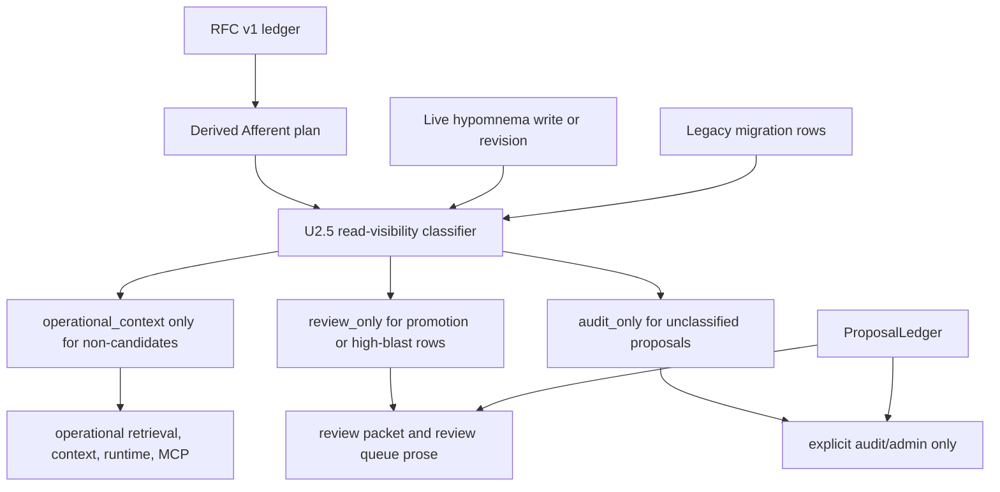

# fix: Repair Afferent Membrane U2.5 Safety Ledger

## Summary

Repair the Afferent Membrane plan and U2 implementation before any U3 authority work starts. The RFC is the safety ledger; the current plan is a derived document that must be corrected against the RFC, then U2 must be tightened so live hypomnema writes, proposal rows, and review surfaces cannot launder high-blast or generated material into operational context.

This is a pre-U3 repair lane. It does not implement harness authority stamping, David-only tiered review, authority stamping, DynamicModulation retrieval influence, live rollout, or global/server integration.

---

## Problem Frame

The current Afferent Membrane plan paraphrased the RFC and lost load-bearing invariants. The result is a dangerous false-closure risk: U1/U2 can look complete while live write paths still make identity/foundational hypomnema operational, proposal rows use non-RFC axes, legacy migration over-quarantines ordinary continuity, and DynamicModulation is planned as active before both RFC bounds exist.

U2.5 exists to repair the safety ledger and the pre-U3 code/test guardrails. It must leave the full architecture intact while preventing U2 from becoming an authority-laundering step.

---

## Assumptions

*This plan was authored without a synchronous confirmation checkpoint. The items below are explicit planning assumptions derived from the RFC, David's hard boundaries, repo inspection, and the read-only review pass.*

- `phenom-felt-review/RFC-v1-proposal-ledger.md` is the source of truth. `docs/plans/2026-06-30-001-feat-afferent-membrane-v1-plan.md` is derived guidance and cannot override it.
- U2.5 may add fail-closed visibility and proposal-ledger guardrails, but must not implement U3's harness-stamped authority model or U4's final David-only decision gate.
- Hypomnema promotion candidates may intentionally use `review_only` rather than the RFC's default `audit_only` so David can inspect them through review surfaces. This is a deliberate recorded deviation, not a schema accident.
- ProposalLedger rows should follow the RFC default: unclassified durable-affecting proposals default to `audit_only` until a classifier or explicit reviewed gate makes them review-visible.
- U2.5 chooses the explicit audit/admin inspection path for `audit_only` ProposalLedger rows. Audit-only rows stay out of ordinary operational/review packet surfaces, but they must still be inspectable through a deliberate David/operator-facing audit surface.
- Existing operational rows should not be silently hidden during migration unless they match the review/audit classifier. Existing row visibility may be preserved only while an update does not cross into high-blast or promotion-candidate territory.
- Any DynamicModulation retrieval influence is out of scope until both the persistence bound and distribution-shape bound exist.

---

## Requirements

The RFC rule IDs below are canonical. Plan-local requirement IDs must not replace or renumber them.

| RFC rule | Source rule | Correct Afferent implementation mapping | U2.5 repair responsibility | Code chokepoints | Proof surface |
|---|---|---|---|---|---|
| RFC-R1 | Authority stamped at ingest | Afferent U3 | State as deferred; remove any U1/U2 claim that authority is solved | `mnemos/mcp_server.py`, `mnemos/simple_runtime.py`, `mnemos/encoding/encoder.py`, `mnemos/importer/pai.py` | Later U3 ingest attack tests |
| RFC-R2 | High-blast domain not self-assertable | Afferent U3 | Add pre-U3 visibility/proposal guardrails for hypomnema so U2 does not violate this before U3 | `mnemos/store/read_visibility.py`, `mnemos/store/sqlite_store.py`, `mnemos/simple_runtime.py`, `mnemos/identity_diff.py`, `mnemos/mcp_server.py` | `tests/test_hypomnema.py`, `tests/test_simple_runtime.py`, `tests/test_identity_diff.py`, `tests/test_mcp_surface.py` |
| RFC-R3 | Universal proposal ledger | Afferent U2 | Align ProposalLedger axes/defaults/statuses with RFC and expose rows through review and explicit audit/admin surfaces | `mnemos/store/sqlite_store.py`, `mnemos/store/migrations.py`, `mnemos/interface/context_packet.py`, `mnemos/mcp_server.py` | `tests/test_store.py`, `tests/test_context_packet.py`, `tests/test_mcp_surface.py` |
| RFC-R4 | Tiered review by blast radius | Afferent U4 | Do not implement; prevent U2 from minting terminal approved/applied states that pretend U4 happened | `mnemos/store/sqlite_store.py` | `tests/test_store.py` |
| RFC-R5 | Read quarantine, pre-rank, all producers | Afferent U2 | Repair classifiers, migration defaults, tag lookup, runtime/MCP/search surfaces, and audit-only visibility | `mnemos/store/read_visibility.py`, `mnemos/store/sqlite_store.py`, `mnemos/retrieval/reactive.py`, `mnemos/interface/context_packet.py`, `mnemos/interface/visual_snapshot.py`, `mnemos/simple_runtime.py`, `mnemos/mcp_server.py`, `mnemos/dream_journal.py` | `tests/test_retrieval.py`, `tests/test_context_packet.py`, `tests/test_simple_runtime.py`, `tests/test_dream_journal.py`, `tests/test_mcp_surface.py` |
| RFC-R6 | `packet_mode = operational | review` | Afferent U1, extended by U2 | Repair plan mapping and ensure proposal/hypomnema review rows follow operational counts/IDs versus review prose | `mnemos/interface/context_packet.py`, `mnemos/mcp_server.py` | `tests/test_context_packet.py`, `tests/test_mcp_surface.py` |
| RFC-R7 | Dynamic modulation double-bounded | Afferent U5/U6 | Repair plan so U5 can scaffold/store only; no active influence before U6 supplies both bounds | `docs/plans/2026-06-30-001-feat-afferent-membrane-v1-plan.md` | Plan review; future `tests/test_dynamic_modulation.py` |
| RFC-R8 | Salience fast-track, authority-qualified | Afferent U5/U6 | Repair plan so salience can fast-track modulation/proposal only, never semantic truth | `docs/plans/2026-06-30-001-feat-afferent-membrane-v1-plan.md` | Plan review; future DynamicModulation and ExperienceTick tests |

There is no RFC-R9. ExperienceTick remains a build-sequence feeder constrained by RFC-R3/R7/R8; it must not become a separate rule or a direct durable-write exception.

---

## Scope Boundaries

- Do not implement U3 authority stamping.
- Do not add payload authority trust, harness-owned authority propagation, or source-authority enforcement beyond aligning U2 ledger vocabulary with the RFC.
- Do not implement U4 David-only review decision/apply workflows.
- Do not enable DynamicModulation to actively influence retrieval.
- Do not mutate live `~/.mnemos`.
- Do not touch launchd, global binaries, global config, boot integration, or live server behavior.
- Do not touch Riley/upstream repositories.
- Do not shrink the full Afferent Membrane architecture.
- Do not treat passing unit tests alone as U2 closure if no-mistakes or equivalent branch validation is still pending elsewhere.

### Deferred to Follow-Up Work

- U3 authority stamping: implement RFC-R1/R2 in the next authority lane after U2.5 passes.
- U4 tiered review gates: add reviewed decision/apply APIs with actor/authorization metadata after U3.
- Direct semantic engram authority policy for `mnemos_remember` and `mnemos_ingest`: keep visible as a U3/R1/R2 risk; do not solve it by pretending U2.5 has authority stamping.
- DynamicModulation active retrieval influence: wait until both U5 persistence bounds and U6 distribution-shape bounds are implemented and tested.
- Live database backfill or operator rollout: separate operator-reviewed plan using backups and explicit live DB authorization.

---

## Context & Research

### Relevant Code and Patterns

- `mnemos/store/read_visibility.py` centralizes read-visibility constants and the current hypomnema promotion-candidate heuristic.
- `mnemos/store/sqlite_store.py` owns ProposalLedger, hypomnema writes/revisions/promotions, search filters, tag lookup, and stats.
- `mnemos/store/migrations.py` owns schema v6/v7 and legacy read-visibility migration behavior.
- `mnemos/interface/context_packet.py` owns operational versus review packet behavior and must remain the primary proof that review prose does not leak into operational packets.
- `mnemos/retrieval/reactive.py` already filters engrams before FTS/embedding seed use and graph propagation; keep this as the pre-rank filtering pattern.
- `mnemos/simple_runtime.py` is the main live bypass: capture encodes an operational engram, writes operational hypomnema, then marks it promoted.
- `mnemos/identity_diff.py` currently writes synthesized identity/foundational hypomnema as operational continuity.
- `mnemos/mcp_server.py` exposes model-facing and operator-facing write/search/promote surfaces and must not expose a model-settable operational override.
- `mnemos/dream_journal.py` uses tag lookup; tag-based hypomnema reads should inherit read-visibility filtering rather than bypass it.
- `templates/AGENTS.md` documents the intended user-facing memory contract: operational packets may show review counts and source IDs, while review-only prose belongs in explicit review surfaces.

### Institutional Learnings

- There is no `docs/solutions/` learning surface in this checkout. The closest local institutional precedent is the existing Afferent plan plus U1/U2 tests.
- Pending-confidence beliefs are excluded by default; review code must opt in explicitly and clear pending state before operational use. Mirror that posture for hypomnema and proposal rows.
- PAI import and review-gate tests use temporary SQLite stores; U2.5 verification should do the same and avoid live memory data.
- Existing review surfaces establish the product rule: quarantine means "not operational," not "hidden from David."

### External References

- Primary source: `phenom-felt-review/RFC-v1-proposal-ledger.md`, supplied outside this repository.

---

## Key Technical Decisions

- The plan ledger is subordinate to the RFC: `docs/plans/2026-06-30-001-feat-afferent-membrane-v1-plan.md` must record the RFC mapping and delete the bogus R9/R10 framing.
- Use a stricter classifier for hypomnema: the migration promotion heuristic remains first-class, and identity/foundational domain or `foundational=True` routes to review/audit even below promotion thresholds unless an explicit trusted gate supplies operational visibility.
- Preserve existing row visibility only when the updated row remains non-candidate. If an omitted-visibility upsert/revision crosses into promotion/high-blast state, visibility must move stricter.
- ProposalLedger public vocabulary must use RFC axes: `source_authority = user_stated/imported/observed/generated` and `kind = episodic/semantic/procedural/prospective`.
- ProposalLedger defaults to `audit_only`; hypomnema promotion candidates deliberately default to `review_only` so David can inspect them in review.
- Audit-only ProposalLedger inspectability is a required U2.5 deliverable: ordinary operational/review packet surfaces exclude audit-only rows, while an explicit audit/admin read path can list them with provenance.
- Raw proposal creation is pending/deferred/rejected review evidence only. U2.5 must not let `write_proposal()` mint `approved` or `applied` states that imply U4 decisions.
- Operational surfaces may show review counts and source IDs for review-visible items, but `audit_only` is invisible except through explicit audit/admin reads.
- DynamicModulation storage/scaffolding is allowed only if inert or fail-conservative. Active retrieval influence requires both persistence and distribution-shape bounds.

---

## Open Questions

### Resolved During Planning

- Before U3 authority stamping, where should high-blast live captures terminate? They terminate as review/proposal state, not as operational engrams or promoted hypomnema.
- What replaces the RFC's generic `chain_write` wording in this repo? Use actual surfaces: `MnemosRuntime.capture`, `EngramStore.close_session_to_hypomnema`, `MnemosRuntime.correct`, `MnemosRuntime._promote_candidates`, `mnemos_hypomnema_write`, and `mnemos_hypomnema_promote`.
- May ordinary operational/review surfaces show `audit_only` existence counts or IDs? No. `audit_only` is invisible except explicit audit/admin reads.
- Should ProposalLedger rows be inspectable in U2.5? Yes. Review-only proposals are inspectable through review packet/review queue surfaces; audit-only proposals are inspectable through an explicit audit/admin surface, not ordinary review mode.

### Deferred to Implementation

- Exact trusted-gate parameter shape for future operational overrides: defer final naming until U4 review gates, but U2.5 should not expose it through model-facing MCP tools.
- Whether direct `mnemos_remember`/`mnemos_ingest` should fail closed on high-blast text before U3: record as U3/R1/R2 risk, not U2.5 authority work.
- Whether generated dream/reflection narratives should become proposal rows or remain low-stakes operational summaries: U2.5 must ensure they cannot act as evidence or hidden high-blast hypomnema; final modulation routing waits for U5/U6.

---

## High-Level Technical Design

> *This illustrates the intended approach and is directional guidance for review, not implementation specification. The implementing agent should treat it as context, not code to reproduce.*

The key ordering is classifier before operational read or promotion. Redaction after formatting is too late; the candidate must not seed ranking, context assembly, runtime maintenance, promotion, or producer input.

---

## Implementation Units

These U-IDs are repair-plan units. They do not replace the Afferent plan's existing U1-U7 labels.

### U1. Repair The Derived RFC Ledger In The Current Plan

**Goal:** Make the current Afferent plan explicitly derived from the RFC, fix rule mappings, remove bogus rule IDs, and record deliberate deviations.

**Requirements:** RFC-R1, RFC-R2, RFC-R3, RFC-R4, RFC-R5, RFC-R6, RFC-R7, RFC-R8

**Dependencies:** None

**Files:**
- Modify: `docs/plans/2026-06-30-001-feat-afferent-membrane-v1-plan.md`

**Approach:**
- Add a source-of-truth statement: the RFC is the ledger; the plan cannot override it.
- Replace the current plan-local R1-R10 list with an RFC rule ledger mapping RFC-R1 through RFC-R8 to Afferent units, code chokepoints, and tests.
- Fix mapping exactly: Afferent U1 maps to RFC-R6; Afferent U2 maps to RFC-R3/R5/R6; Afferent U3 maps to RFC-R1/R2; Afferent U4 maps to RFC-R4; Afferent U5/U6 map to RFC-R7/R8.
- Remove or rewrite R9/R10. ExperienceTick remains a build-sequence feeder constrained by RFC-R3/R7/R8, not a separate rule.
- Record the deliberate `review_only` hypomnema deviation from the RFC `audit_only` default.
- Repair U5/U6 DynamicModulation language so U5 may scaffold/store only; active influence waits for both RFC-R7 bounds.

**Execution note:** Treat this as a safety-ledger edit, not prose cleanup. Preserve both headline blockers and small findings.

**Patterns to follow:**
- RFC rule wording in `phenom-felt-review/RFC-v1-proposal-ledger.md`.
- Existing plan section structure in `docs/plans/2026-06-30-001-feat-afferent-membrane-v1-plan.md`.

**Test scenarios:**
- Test expectation: none - this is a documentation/plan repair.

**Verification:**
- The plan contains an explicit RFC-R1 through RFC-R8 ledger.
- The repaired Afferent plan does not use RFC-R9 or RFC-R10 as operative rule IDs.
- The plan no longer claims U1/U2 satisfy authority stamping or high-blast non-self-assertion.
- DynamicModulation cannot be read as active retrieval influence before both bounds exist.

### U2. Align ProposalLedger With The RFC Contract

**Goal:** Repair ProposalLedger vocabulary, defaults, and status semantics so it is a safety ledger instead of a schema-only table.

**Requirements:** RFC-R3, RFC-R4, RFC-R5

**Dependencies:** U1

**Files:**
- Modify: `mnemos/store/sqlite_store.py`
- Modify: `mnemos/store/migrations.py`
- Test: `tests/test_store.py`

**Approach:**
- Change public ProposalLedger authority values to the RFC vocabulary: `user_stated`, `imported`, `observed`, `generated`.
- Change public ProposalLedger kind values to the RFC axis: `episodic`, `semantic`, `procedural`, `prospective`.
- Add `deferred` as a first-class status.
- Make proposal `read_visibility` default to `audit_only`.
- Define and enforce a status-by-visibility matrix: `pending_review`, `deferred`, and `rejected` cannot be `operational_context`; any future `applied` operational state must come from a reviewed gate, not raw proposal creation.
- Restrict raw proposal creation to non-terminal review/audit lifecycle states. Do not let U2.5 implement U4 apply/approve behavior.
- Decide whether existing non-RFC aliases such as `agent_generated` and `agent_observed` are rejected, migrated to canonical values, or accepted only as deprecated input aliases that serialize canonically.

**Execution note:** Characterization-first for the current ProposalLedger tests, then tighten the contract.

**Patterns to follow:**
- `_clean_choice` and validation style in `mnemos/store/sqlite_store.py`.
- Pending-review belief exclusion and lifecycle handling in `mnemos/core/belief.py` and `mnemos/store/sqlite_store.py`.

**Test scenarios:**
- Happy path: `write_proposal(source_authority="generated", kind="semantic")` succeeds and stores canonical RFC values.
- Happy path: `write_proposal(status="deferred")` succeeds and remains non-operational.
- Happy path: omitted proposal `read_visibility` stores `audit_only`.
- Edge case: deprecated aliases, if accepted, serialize back as RFC canonical values.
- Error path: `write_proposal(status="pending_review", read_visibility="operational_context")` raises a clear error.
- Error path: raw `write_proposal(status="applied")` or `status="approved"` is rejected until U4 decision APIs exist.

**Verification:**
- ProposalLedger rows can be created with RFC axes.
- Unclassified proposal rows are not visible to ordinary review or operational surfaces.
- Terminal/applied state cannot be forged through raw proposal writes.

### U3. Repair Hypomnema Classification, Migration, And Upsert Semantics

**Goal:** Ensure omitted `read_visibility` is classified at write time, migration preserves ordinary legacy continuity, and existing rows cannot cross into review-worthy status while staying operational by omission.

**Requirements:** RFC-R2, RFC-R5

**Dependencies:** U2 for migration/test sequencing only. The classifier and migration repair can be reasoned about independently, but U2 and U3 both edit `mnemos/store/migrations.py` and `tests/test_store.py`; land the v6 migration edits as one coherent repair rather than split across separately merged units.

**Files:**
- Modify: `mnemos/store/read_visibility.py`
- Modify: `mnemos/store/sqlite_store.py`
- Modify: `mnemos/store/migrations.py`
- Test: `tests/test_hypomnema.py`
- Test: `tests/test_store.py`

**Approach:**
- Keep the migration promotion-candidate heuristic as the first classifier: `confidence >= 0.82 AND salience >= 0.65 AND (foundational OR revision_count >= 1) => review_only`.
- Extend classification so `domain in {"identity", "foundational"}` or `foundational=True` cannot become operational by omitted visibility, even below promotion thresholds.
- Preserve existing row visibility on upsert only if the updated row remains in the same or lower-risk class.
- Reclassify omitted-visibility upserts and revisions when confidence, salience, revision count, foundational flag, or domain makes the row review-worthy.
- Fix the v6 migration mechanism explicitly: add the legacy `hypomnema_entries.read_visibility` column with default `operational_context`, then run the candidate/high-blast UPDATE that moves only matching rows to `review_only` or stricter. Do not keep a blanket `review_only` column default plus a redundant candidate UPDATE.
- Add a `read_visibility` filter to tag-based hypomnema lookup so tag readers such as dream journal cannot bypass default operational filtering.

**Execution note:** Start with failing migration and revision-threshold tests; the current raw store classifier test is necessary but not sufficient.

**Patterns to follow:**
- `is_hypomnema_promotion_candidate` in `mnemos/store/read_visibility.py`.
- `_apply_read_visibility_filter` in `mnemos/store/sqlite_store.py`.
- Legacy v5 migration fixture style in `tests/test_store.py`.

**Test scenarios:**
- Happy path: fresh high-confidence/foundational hypomnema with omitted visibility stores `review_only`.
- Happy path: fresh identity-domain hypomnema with low salience and omitted visibility stores `review_only` or stricter.
- Happy path: ordinary legacy hypomnema below thresholds migrate to `operational_context`.
- Happy path: legacy promotion/high-blast hypomnema migrate to `review_only`.
- Edge case: omitted-visibility upsert preserves existing operational visibility when the row remains ordinary.
- Edge case: omitted-visibility upsert/revision moves an operational row to `review_only` when it crosses promotion/high-blast thresholds.
- Error path: explicit operational visibility for a review-worthy row is rejected unless supplied through a trusted internal gate that is not exposed to model-facing tools.
- Integration: tag lookup excludes review-only and audit-only rows by default.

**Verification:**
- Operational hypomnema search and tag lookup cannot return newly review-worthy rows.
- Migration does not erase ordinary continuity from operational context.
- The classifier is the only default path for omitted visibility.

### U4. Repair Live Hypomnema Write Chokepoints

**Goal:** Stop live runtime/MCP/identity-diff paths from bypassing U2 classification by explicitly forcing operational visibility or immediate promotion.

**Requirements:** RFC-R2, RFC-R5, RFC-R6

**Dependencies:** U3

**Files:**
- Modify: `mnemos/simple_runtime.py`
- Modify: `mnemos/identity_diff.py`
- Modify: `mnemos/mcp_server.py`
- Test: `tests/test_simple_runtime.py`
- Test: `tests/test_identity_diff.py`
- Test: `tests/test_mcp_surface.py`

**Approach:**
- In `MnemosRuntime.capture`, classify the hypomnema write before encoding/promoting. If the row is review-only or audit-only, do not create an operational engram carrying the same prose and do not mark the hypomnema promoted.
- Keep ordinary non-candidate captures operational when they are not high-blast and do not cross the classifier.
- Change identity-diff notes so synthesized identity/foundational divergence material is review-only until explicitly accepted.
- Ensure `mnemos_hypomnema_write` omits model-settable visibility, reports resulting visibility, and proves high-confidence/foundational writes are review-visible only.
- Make `mnemos_hypomnema_search` exclude operational promotion candidates by default, matching context packets and visual snapshots.
- Preserve existing MCP reject behavior for non-operational promote/revise/supersede/forget targets.

**Execution note:** Use end-to-end product-path tests, not only raw store writes. The temp-DB runtime path is the important proof.

**Patterns to follow:**
- `tests/test_simple_runtime.py` temp database runtime tests.
- `tests/test_mcp_surface.py` monkeypatch/store setup for MCP tool tests.
- Existing non-operational mutation refusal tests in `tests/test_mcp_surface.py`.

**Test scenarios:**
- Happy path: ordinary non-high-blast capture still creates operational continuity and recallable context.
- Happy path: high-importance identity/foundational capture stores review/proposal state only, with no operational engram and no promoted hypomnema.
- Happy path: maintenance does not auto-promote a default review-only foundational hypomnema.
- Happy path: identity-diff divergence note stores review-only and is visible only through explicit review mode.
- Error path: MCP promote/revise/supersede/forget still rejects review-only and audit-only hypomnema without leaking prose.
- Integration: MCP hypomnema write with omitted visibility, high confidence, high salience, and `foundational=True` is absent from operational search/candidates/promote/context and visible through review.

**Verification:**
- The normal live write path no longer bypasses the store classifier.
- Fresh high-confidence/foundational hypomnema cannot become operational just because it was written after migration.
- U2.5 does not implement authority stamping; it only prevents operational laundering before U3.

### U5. Expose Proposal And Review State Through Safe Surfaces

**Goal:** Make the proposal ledger inspectable through review-visible and explicit audit/admin surfaces while keeping operational and audit boundaries intact.

**Requirements:** RFC-R3, RFC-R5, RFC-R6

**Dependencies:** U2, U3

**Files:**
- Modify: `mnemos/interface/context_packet.py`
- Modify: `mnemos/interface/visual_snapshot.py`
- Modify: `mnemos/mcp_server.py`
- Modify: `mnemos/store/sqlite_store.py`
- Test: `tests/test_store.py`
- Test: `tests/test_context_packet.py`
- Test: `tests/test_mcp_surface.py`
- Test: `tests/test_retrieval.py`

**Approach:**
- Extend review queue/context packet data to include review-visible proposal counts and source IDs in operational mode.
- In review mode, expose review-only proposal payload/provenance labels with source authority, kind, domain, target surface, transition, blast radius, status, gate version, and provenance IDs.
- Keep audit-only proposal rows out of ordinary operational and review packet surfaces.
- Add an explicit read-only store/API audit/admin affordance for audit-only ProposalLedger inspection. This is a real U2.5 deliverable, not a test-only helper, and it must not make audit-only rows part of ordinary review mode.
- Ensure proposal payloads and review-only/audit-only rows cannot seed retrieval, prompt assembly, graph propagation, or producer input.

**Execution note:** Test operational JSON as well as formatted prompt text. Redaction in one representation does not prove the other is safe.

**Patterns to follow:**
- Operational review references in `mnemos/interface/context_packet.py`.
- MCP review queue formatting in `mnemos/mcp_server.py`.
- Retrieval pre-filter tests in `tests/test_retrieval.py`.

**Test scenarios:**
- Happy path: operational packet includes proposal review count/source IDs without payload prose.
- Happy path: review packet includes review-only proposal payload and provenance labels.
- Happy path: explicit audit/admin read lists audit-only proposal rows with provenance without promoting them to review or operational visibility.
- Happy path: MCP review queue includes review-only proposal rows with provenance labels.
- Edge case: audit-only proposal rows are absent from normal review packet and review queue.
- Error path: formatting a redacted operational packet as review mode cannot escalate withheld payload prose.
- Integration: proposal payload/review-only/audit-only rows cannot enter operational retrieval, prompt building, runtime context, or producer input.

**Verification:**
- ProposalLedger is inspectable as a safety ledger without becoming operational input.
- Operational and review packet contracts stay consistent across JSON and prompt text.
- Audit-only remains stronger than review-only.

### U6. Repair DynamicModulation Safety Sequencing

**Goal:** Ensure the plan cannot be read as allowing DynamicModulation to actively influence retrieval before both RFC-R7 bounds are implemented.

**Requirements:** RFC-R7, RFC-R8

**Dependencies:** U1

**Files:**
- Modify: `docs/plans/2026-06-30-001-feat-afferent-membrane-v1-plan.md`

**Approach:**
- Rewrite Afferent U5 so it can scaffold/store modulation records only if they are inert or conservative.
- State that active retrieval/salience influence requires both the persistence bound and distribution-shape bound.
- Define the persistence bound as TTL/decay/magnitude.
- Define the distribution-shape bound as valence floor, deadband, and fail-toward-width behavior.
- State that U5 alone must not shape live retrieval; U6 is the earliest point where bounded influence can be considered.
- Keep DynamicModulation non-evidentiary and barred from belief/identity authority.

**Execution note:** This is a plan repair, not DynamicModulation implementation.

**Patterns to follow:**
- RFC-R7/R8 wording in the external RFC.
- Existing "do not treat DynamicModulation as evidence" scope boundary in the current plan.

**Test scenarios:**
- Test expectation: none for U2.5 implementation - this is a documentation/plan sequencing repair. Future U5/U6 must add `tests/test_dynamic_modulation.py` and `tests/test_dynamic_modulation_valence_floor.py`.

**Verification:**
- The current plan states U5 is inert/conservative until U6 completes.
- Future DynamicModulation acceptance tests cannot be marked passed by persistence bounds alone.

### U7. Regression Proof And Closure Gate

**Goal:** Define the exact focused proof required before U2 can be called closed.

**Requirements:** RFC-R2, RFC-R3, RFC-R5, RFC-R6

**Dependencies:** U2, U3, U4, U5, U6

**Files:**
- Test: `tests/test_hypomnema.py`
- Test: `tests/test_store.py`
- Test: `tests/test_simple_runtime.py`
- Test: `tests/test_identity_diff.py`
- Test: `tests/test_mcp_surface.py`
- Test: `tests/test_context_packet.py`
- Test: `tests/test_retrieval.py`
- Test: `tests/test_dream_journal.py`

**Approach:**
- Add named regression tests for the repaired classifier, proposal defaults, migration behavior, runtime write paths, review surfaces, and audit-only invisibility.
- Preserve existing U1/U2 tests that already prove operational packet redaction and retrieval pre-filtering.
- Treat no-mistakes as a closure requirement, but do not interfere with any no-mistakes lane already running in another thread.
- Before calling U2 closed, run a final adversarial read against three exact bug shapes:
  - Explicit `READ_VISIBILITY_OPERATIONAL` overrides on synthesized, identity, or foundational write paths; every remaining match must be justified by a trusted gate or changed.
  - Raw ProposalLedger terminal-state creation; `write_proposal()` must not persist `approved` or `applied` without a reviewed-gate path.
  - v6 migration backfill behavior on a populated legacy database; non-candidate legacy hypomnema must remain `operational_context` while candidates become `review_only` or stricter.

**Targeted test nodes to add or update:**
- `tests/test_hypomnema.py::TestHypomnemaStore::test_identity_or_foundational_hypomnema_defaults_review_only_even_below_promotion_threshold`
- `tests/test_hypomnema.py::TestHypomnemaStore::test_upsert_and_revise_reclassify_operational_row_crossing_promotion_threshold`
- `tests/test_store.py::test_proposal_ledger_accepts_rfc_authority_and_kind_axes`
- `tests/test_store.py::test_proposal_ledger_defaults_to_audit_only_and_rejects_pending_operational_visibility`
- `tests/test_store.py::test_legacy_v5_migrates_non_candidate_hypomnema_operational_and_candidates_review_only`
- `tests/test_store.py::test_get_hypomnema_entries_by_tag_filters_read_visibility_by_default`
- `tests/test_simple_runtime.py::test_capture_foundational_identity_note_is_review_only_and_not_promoted`
- `tests/test_simple_runtime.py::test_maintain_does_not_promote_fresh_default_review_only_foundational_hypomnema`
- `tests/test_identity_diff.py::test_identity_diff_note_defaults_review_only_until_acceptance`
- `tests/test_mcp_surface.py::test_mcp_hypomnema_write_default_review_only_is_quarantined_from_search_candidates_promote_and_visible_in_review`
- `tests/test_mcp_surface.py::test_hypomnema_search_excludes_operational_promotion_candidates`
- `tests/test_context_packet.py::test_proposal_rows_are_counts_only_operational_and_labeled_in_review`
- `tests/test_context_packet.py::test_audit_only_proposal_and_hypomnema_are_absent_from_review_packet`
- `tests/test_store.py::test_list_proposals_audit_visibility_requires_explicit_audit_read`
- `tests/test_mcp_surface.py::test_audit_admin_proposal_review_lists_audit_only_rows_without_operational_exposure`
- `tests/test_retrieval.py::test_review_and_audit_rows_do_not_seed_operational_retrieval`
- `tests/test_dream_journal.py::test_dream_journal_tag_lookup_respects_hypomnema_read_visibility`

**Patterns to follow:**
- Temp SQLite fixtures in `tests/conftest.py`.
- Existing focused tests in `tests/test_context_packet.py`, `tests/test_hypomnema.py`, `tests/test_retrieval.py`, and `tests/test_mcp_surface.py`.

**Test scenarios:**
- Happy path: fresh high-confidence/foundational hypomnema without explicit `read_visibility` is present only through explicit review visibility.
- Happy path: ordinary legacy hypomnema remains operational after migration.
- Error path: proposal rows cannot be pending and operational at the same time.
- Error path: raw proposal writes cannot forge applied/approved states.
- Integration: runtime capture, MCP write/search/promote, context packets, retrieval, and tag lookup all agree on visibility.

**Verification:**
- Every targeted test node passes locally using temporary stores.
- No operational search, context, promotion, retrieval, dream/tag, or MCP surface emits fresh high-confidence/foundational omitted-visibility hypomnema prose.
- No proposal payload is visible outside its intended review/audit surface.
- The final adversarial checklist is clean: no unjustified `READ_VISIBILITY_OPERATIONAL` overrides on synthesized/identity/foundational writes; `write_proposal()` cannot persist `approved` or `applied` without a reviewed-gate path; a populated legacy v5 database leaves non-candidate hypomnema operational after v6 migration.
- U2 is not reported closed until this focused proof and the branch validation lane pass cleanly.

---

## System-Wide Impact

- **Interaction graph:** U2.5 touches store classification, migrations, runtime capture, identity-diff notes, MCP review/search/promote tools, context packet formatting, visual summaries, retrieval pre-filters, and tag-based hypomnema reads.
- **Error propagation:** invalid visibility/status/axis combinations should fail closed with clear `ValueError` or MCP error strings and no partial operational write.
- **State lifecycle risks:** migrations must preserve ordinary continuity while quarantining high-blast candidates; upserts/revisions must not preserve stale operational visibility after crossing thresholds.
- **API surface parity:** simple runtime, advanced MCP, context packets, visual snapshots, store helpers, and retrieval must agree on operational/review/audit visibility.
- **Integration coverage:** raw store tests are insufficient; runtime and MCP product paths must be tested because they were the bypasses.
- **Unchanged invariants:** U2.5 does not add authority stamping, does not approve/apply proposals, does not mutate live DBs, and does not activate DynamicModulation retrieval effects.

---

## Risks & Dependencies

| Risk | Likelihood | Impact | Mitigation |
|---|---:|---:|---|
| U2.5 accidentally implements U3 authority stamping | Medium | High | Keep source authority as canonical RFC metadata only; do not trust payload claims or add harness decisions in this lane. |
| Ordinary legacy continuity disappears after migration | High | High | Add explicit legacy non-candidate migration test and classify legacy rows instead of defaulting all hypomnema to review-only. |
| Review-only candidate prose leaks through a non-packet producer | High | High | Test runtime capture/maintain, MCP search/promote, retrieval, context packet JSON/prompt, and tag lookup. |
| ProposalLedger becomes forgeable authority | High | High | Default to audit-only, reject pending operational rows, and prevent raw terminal applied/approved creation. |
| Audit-only items become visible through ordinary counts or IDs | Medium | Medium | Define audit-only as explicit audit/admin only, require a dedicated inspection path, and test ordinary review/operational absence. |
| DynamicModulation becomes hidden retrieval steering too early | Medium | High | Repair plan sequencing so U5 is inert/conservative until U6 completes both bounds. |

---

## Documentation / Operational Notes

- Update `docs/plans/2026-06-30-001-feat-afferent-membrane-v1-plan.md` first, then code. The plan is currently suspect and should not steer implementation until repaired.
- Update user/operator documentation only if it currently overclaims U1/U2 safety or ProposalLedger behavior.
- Do not update launchd, installation docs, or live rollout instructions in U2.5.
- Record the `review_only` hypomnema deviation plainly anywhere schema/default behavior is documented.
- Record that ProposalLedger `audit_only` is the RFC-default quarantine state.

---

## Success Metrics

- The current Afferent plan has a correct RFC-R1 through RFC-R8 ledger and no operative bogus RFC-R9/R10 rules.
- Fresh high-confidence/foundational omitted-visibility hypomnema is absent from operational search, context, retrieval, promotion, runtime maintenance, MCP search/promote, and tag lookup.
- The same hypomnema is visible only through explicit review visibility.
- Ordinary legacy hypomnema remains operational after migration unless it is a promotion/high-blast candidate.
- ProposalLedger accepts RFC axes, defaults to audit-only, rejects pending operational visibility, and cannot forge terminal apply/approve state.
- Audit-only ProposalLedger rows are inspectable through an explicit audit/admin path while remaining absent from ordinary operational and review packet surfaces.
- DynamicModulation is documented as inert/conservative until both RFC-R7 bounds exist.

---

## Sources & References

- Primary source: `phenom-felt-review/RFC-v1-proposal-ledger.md`
- Suspect plan to repair: `docs/plans/2026-06-30-001-feat-afferent-membrane-v1-plan.md`
- Related code: `mnemos/store/read_visibility.py`
- Related code: `mnemos/store/sqlite_store.py`
- Related code: `mnemos/store/migrations.py`
- Related code: `mnemos/simple_runtime.py`
- Related code: `mnemos/identity_diff.py`
- Related code: `mnemos/mcp_server.py`
- Related code: `mnemos/interface/context_packet.py`
- Related code: `mnemos/interface/visual_snapshot.py`
- Related code: `mnemos/retrieval/reactive.py`
- Related tests: `tests/test_hypomnema.py`
- Related tests: `tests/test_store.py`
- Related tests: `tests/test_simple_runtime.py`
- Related tests: `tests/test_identity_diff.py`
- Related tests: `tests/test_mcp_surface.py`
- Related tests: `tests/test_context_packet.py`
- Related tests: `tests/test_retrieval.py`
- Related tests: `tests/test_dream_journal.py`
