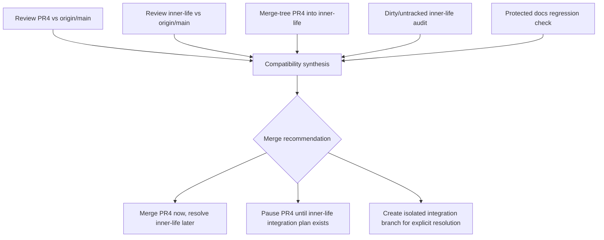

# PR4 and Inner-Life Compatibility Review

## Summary

Plan a read-only compatibility review between PR4 (`codex/afferent-membrane-v1-ledger`) and the active inner-life branch (`feat/gated-inner-life-soak`) before any merge decision. The review must use `ce-code-review` as the primary code-review lens, identify text and semantic incompatibilities, and verify that the recently captured cross-worktree merge guard remains protected.

---

## Problem Frame

PR4 is clean against `origin/main`, but the active inner-life branch conflicts with it. A base-branch merge check is therefore not enough: David asked whether the merge would conflict with other work, which requires reviewing the active parallel branch and the final integration shape, not only the PR's GitHub mergeability.

---

## Requirements

- R1. Review PR4 in report-only mode against `origin/main`, using the Afferent Membrane plan as requirements context.
- R2. Review the inner-life work in report-only mode without switching or mutating the dirty active checkout.
- R3. Identify direct merge conflicts and semantic incompatibilities between PR4 and inner-life, especially around store, migration, substrate handler, context/MCP, and test surfaces.
- R4. Verify the compatibility path does not remove or invalidate the recently added cross-worktree merge guard learning.
- R5. Produce a merge recommendation that distinguishes "clean into main" from "safe relative to active local work."
- R6. Do not merge, rebase, reset, stage, commit, push, or run No Mistakes unless David explicitly authorizes the next step.

---

## Scope Boundaries

- This is a review and planning task, not a merge task.
- Do not implement conflict resolutions in either branch during this review.
- Do not mutate the active inner-life worktree.
- Do not touch `upstream` / Riley remotes.
- Do not mutate live `~/.mnemos`, launchd, global binaries, global config, boot integration, or live server behavior.
- Treat `docs/solutions/*` and `docs/plans/*` as protected Compound Engineering artifacts; reviewers must not recommend deleting or gitignoring them.

### Deferred to Follow-Up Work

- Conflict resolution: separate implementation pass after David chooses whether PR4 should merge first or be integrated into inner-life first.
- No Mistakes rerun: separate validation pass only after the intended integration target is clear.

---

## Context & Research

### Relevant Code and Patterns

- PR4 head: `ba932230e3ac288054e900db6914103e3029ea38`.
- Current `origin/main`: `03c94171a3aeb831c57bd35a2974a659749da20d`.
- Active inner-life branch: `feat/gated-inner-life-soak` at `375cdce`, with dirty working-tree changes.
- `git merge-tree --write-tree origin/main origin/codex/afferent-membrane-v1-ledger` succeeds.
- `git merge-tree --write-tree feat/gated-inner-life-soak origin/codex/afferent-membrane-v1-ledger` reports content conflicts in:
  - `mnemos/store/migrations.py`
  - `mnemos/store/sqlite_store.py`
  - `mnemos/substrate/handlers/dreaming.py`
  - `mnemos/substrate/handlers/wandering.py`
  - `tests/test_cli_simple.py`
  - `tests/test_u3a_schema_migrations.py`

### Institutional Learnings

- `docs/solutions/workflow-issues/pr-merge-readiness-cross-worktree-conflict-check-2026-07-01.md`: PR merge readiness must check active worktrees and parallel branches, not only base-branch mergeability.
- `docs/solutions/workflow-issues/afferent-membrane-safety-ledger-repair-workflow-2026-07-01.md`: false readiness also occurs when the validation head, plan ledger, or proof surface is stale.

### External References

- External research is not needed. The task is internal branch/worktree compatibility review, and the needed evidence is in git state, local diffs, plans, and solution docs.

---

## Key Technical Decisions

- Use `ce-code-review` in `mode:report-only` for both branches so review cannot mutate either checkout.
- Use branch-local reviews first, then a compatibility synthesis; `ce-code-review` finds code-level issues inside each diff, while `git merge-tree` and file-intersection analysis identify cross-branch incompatibility.
- Treat untracked/dirty inner-life files as part of the review evidence even when `ce-code-review` excludes them from tracked diff scope.
- Make the last compound doc a regression artifact: any proposed integration must preserve it and its related Afferent workflow doc.
- Keep the final recommendation tri-valued: merge PR4 now and resolve inner-life later, pause PR4 until inner-life integration is planned, or create an integration branch for explicit conflict resolution.

---

## Open Questions

### Resolved During Planning

- Should PR4 be considered mergeable into `main`? Yes, technically: the base-branch merge-tree succeeds.
- Should PR4 be considered integration-safe relative to active inner-life work? No, not yet: the active branch conflicts at committed-branch level and the worktree has additional dirty changes.

### Deferred to Implementation

- Exact conflict resolution choices in store/migration/substrate/test files: defer until David chooses the integration order.
- Whether to run No Mistakes again after compatibility review: defer until there is a concrete integration candidate.

---

## High-Level Technical Design

> *This illustrates the intended approach and is directional guidance for review, not implementation specification. The implementing agent should treat it as context, not code to reproduce.*



---

## Implementation Units

### U1. PR4 Report-Only Code Review

**Goal:** Review PR4's current head against `origin/main` without applying fixes.

**Requirements:** R1, R3, R4, R6

**Dependencies:** None

**Files:**
- Read: `docs/plans/2026-06-30-001-feat-afferent-membrane-v1-plan.md`
- Read: `docs/plans/2026-06-30-002-fix-afferent-u2-5-safety-ledger-plan.md`
- Read: `docs/solutions/workflow-issues/pr-merge-readiness-cross-worktree-conflict-check-2026-07-01.md`
- Review: PR4 changed files against `origin/main`

**Approach:**
- Run `ce-code-review` from the PR4 checkout in `mode:report-only`.
- Pass `base:origin/main` so the shared checkout is not switched.
- Pass the main Afferent plan as `plan:` context so requirements completeness includes the safety ledger.
- Preserve any findings about `docs/solutions/*` as protected-artifact checks, not cleanup suggestions.

**Prompt to use:**

```text
Use ce-code-review in report-only mode on the current PR4 checkout.

Invocation target:
the ce-code-review skill mode:report-only base:origin/main plan:docs/plans/2026-06-30-001-feat-afferent-membrane-v1-plan.md

Review intent:
PR4 (`codex/afferent-membrane-v1-ledger`, head `ba932230e3ac288054e900db6914103e3029ea38`) repairs the Afferent Membrane U2/U2.5 safety ledger and visibility boundaries. Review it for correctness, safety-ledger completeness, protected docs handling, and compatibility risk with active inner-life work. Do not apply fixes, stage files, commit, push, merge, rebase, or run No Mistakes.

Extra focus:
- Preserve `docs/solutions/workflow-issues/pr-merge-readiness-cross-worktree-conflict-check-2026-07-01.md`.
- Preserve `docs/solutions/workflow-issues/afferent-membrane-safety-ledger-repair-workflow-2026-07-01.md`.
- Treat `docs/plans/*` and `docs/solutions/*` as protected Compound Engineering artifacts.
- Flag any PR4 changes that likely conflict semantically with inner-life surfaces: store, migrations, substrate handlers, context packet, visual snapshot, MCP, CLI tests, and schema migration tests.
```

**Patterns to follow:**
- Use `mode:report-only` because the objective is compatibility evidence, not automatic repair.
- Use `base:` rather than a PR number so the shared checkout is not switched.

**Test scenarios:**
- Test expectation: none -- this unit is a read-only review pass. Its verification is the existence of a complete ce-code-review report.

**Verification:**
- The report includes findings or a clean verdict for PR4.
- The report confirms no protected docs deletion/cleanup recommendation survived synthesis.

---

### U2. Inner-Life Report-Only Code Review

**Goal:** Review active inner-life changes without mutating the dirty worktree.

**Requirements:** R2, R3, R6

**Dependencies:** None

**Files:**
- Review: inner-life changed files against `origin/main`
- Inspect: untracked inner-life files and dirty worktree paths

**Approach:**
- Run `ce-code-review` from the inner-life checkout in `mode:report-only base:origin/main`.
- Do not ask the review skill to switch branches.
- Capture the untracked-file warning as evidence, not as a reason to stage files.
- Separately inspect dirty and untracked paths because report-only diff scope may exclude untracked files.

**Prompt to use:**

```text
Use ce-code-review in report-only mode from the active inner-life checkout.

Invocation target:
the ce-code-review skill mode:report-only base:origin/main

Review intent:
The active inner-life branch (`feat/gated-inner-life-soak`, observed head `375cdce`) contains dirty local work that may conflict with PR4. Review the tracked diff against `origin/main` without switching branches or mutating the checkout. Also report any untracked files that ce-code-review excludes, because they may still matter for PR4 compatibility.

Extra focus:
- Identify assumptions inner-life makes about store schema, visibility defaults, durable memory gates, substrate handler retrieval, context packet surfaces, MCP surfaces, CLI behavior, and migration tests.
- Flag changes that appear incompatible with PR4's Afferent Membrane U2/U2.5 visibility and proposal-ledger hardening.
- Do not apply fixes, stage files, commit, push, merge, rebase, or run No Mistakes.
```

**Patterns to follow:**
- Keep the dirty checkout read-only.
- Treat unstaged and untracked files as live evidence, not as changes to clean up.

**Test scenarios:**
- Test expectation: none -- this unit is a read-only review pass. Its verification is a complete review report plus an explicit untracked/dirty-file inventory.

**Verification:**
- The report identifies inner-life findings and scope exclusions.
- The inventory names dirty/untracked paths that need compatibility attention.

---

### U3. Cross-Branch Compatibility Synthesis

**Goal:** Compare PR4 and inner-life findings to identify direct and semantic incompatibilities.

**Requirements:** R3, R5, R6

**Dependencies:** U1, U2

**Files:**
- Inspect: `mnemos/store/migrations.py`
- Inspect: `mnemos/store/sqlite_store.py`
- Inspect: `mnemos/substrate/handlers/dreaming.py`
- Inspect: `mnemos/substrate/handlers/wandering.py`
- Inspect: `tests/test_cli_simple.py`
- Inspect: `tests/test_u3a_schema_migrations.py`
- Inspect: `mnemos/cli.py`
- Inspect: `mnemos/mcp_server.py`
- Inspect: `mnemos/interface/context_packet.py`
- Inspect: `mnemos/interface/visual_snapshot.py`
- Inspect: `mnemos/simple_runtime.py`

**Approach:**
- Start from known `merge-tree` conflict files.
- Add semantic overlap paths from both review reports, especially shared operational/review/audit surfaces.
- Classify each incompatibility:
  - text conflict;
  - schema/migration ordering conflict;
  - behavior-policy conflict;
  - test-expectation conflict;
  - protected-artifact conflict.
- For each conflict, record which side owns which invariant and what evidence proves it.

**Prompt to use:**

```text
Synthesize the PR4 ce-code-review report, the inner-life ce-code-review report, and the known merge-tree conflicts.

Known conflict files:
- mnemos/store/migrations.py
- mnemos/store/sqlite_store.py
- mnemos/substrate/handlers/dreaming.py
- mnemos/substrate/handlers/wandering.py
- tests/test_cli_simple.py
- tests/test_u3a_schema_migrations.py

Classify every incompatibility as text conflict, schema/migration ordering conflict, behavior-policy conflict, test-expectation conflict, or protected-artifact conflict. For each one, state:
- PR4 invariant;
- inner-life invariant;
- exact file(s);
- why both cannot be accepted blindly;
- safest next action.

Do not resolve conflicts. This is a compatibility report, not implementation.
```

**Patterns to follow:**
- Separate direct merge conflicts from semantic conflicts.
- Treat review/audit visibility, proposal-ledger terminal immutability, and DynamicModulation inertness as PR4 invariants unless David explicitly changes the safety ledger.

**Test scenarios:**
- Test expectation: none -- this unit produces a report. Follow-up implementation will own executable tests.

**Verification:**
- The compatibility report lists every known merge-tree conflict file.
- The report adds semantic conflicts beyond text conflicts when applicable.
- The report does not collapse clean `main` mergeability into integration safety.

---

### U4. Last-Work Regression Guard

**Goal:** Ensure future compatibility work does not break the compound learning and plan safety artifacts just added.

**Requirements:** R4, R6

**Dependencies:** U3

**Files:**
- Inspect: `docs/solutions/workflow-issues/pr-merge-readiness-cross-worktree-conflict-check-2026-07-01.md`
- Inspect: `docs/solutions/workflow-issues/afferent-membrane-safety-ledger-repair-workflow-2026-07-01.md`
- Inspect: `docs/plans/2026-06-30-001-feat-afferent-membrane-v1-plan.md`
- Inspect: `docs/plans/2026-06-30-002-fix-afferent-u2-5-safety-ledger-plan.md`
- Inspect: `docs/plans/afferent-membrane-plan-quality-gate.md`
- Test: `tests/test_afferent_plan_quality.py`

**Approach:**
- Treat the cross-worktree merge guard doc as a regression artifact.
- Require any integration candidate to preserve both solution docs and plan-quality tests.
- If a conflict resolution touches `docs/plans/*` or `docs/solutions/*`, require explicit justification and validator proof.

**Prompt to use:**

```text
Before any merge or integration recommendation, verify that the compatibility path preserves the last Compound Engineering work:
- docs/solutions/workflow-issues/pr-merge-readiness-cross-worktree-conflict-check-2026-07-01.md
- docs/solutions/workflow-issues/afferent-membrane-safety-ledger-repair-workflow-2026-07-01.md
- docs/plans/afferent-membrane-plan-quality-gate.md
- tests/test_afferent_plan_quality.py

Protected artifact rule:
Do not delete, ignore, or treat Compound Engineering docs/plans or docs/solutions files as disposable cleanup. If a reviewer flags one, discard that finding unless it identifies a concrete correctness issue in the content.

Return whether the final recommended path preserves these artifacts and what proof should be run after conflict resolution.
```

**Patterns to follow:**
- Protected artifacts are not runtime clutter.
- The last doc exists because the previous merge-readiness check failed; do not erase the guard while solving the conflict it describes.

**Test scenarios:**
- Positive: integration candidate still includes both solution docs and `tests/test_afferent_plan_quality.py`.
- Negative: any proposed resolution that deletes the cross-worktree merge guard is rejected unless David explicitly authorizes removing it.

**Verification:**
- The compatibility report has a "Last-work regression guard" section.
- The report states the exact artifacts that must survive integration.

---

### U5. Merge Recommendation and Next-Step Plan

**Goal:** Turn review evidence into a clear merge recommendation without performing the merge.

**Requirements:** R5, R6

**Dependencies:** U1, U2, U3, U4

**Files:**
- Create or update: compatibility report artifact chosen by the reviewing agent

**Approach:**
- Recommend one of three paths:
  - merge PR4 now, explicitly accepting that inner-life conflict resolution follows later;
  - pause PR4 and resolve inner-life compatibility first;
  - create an isolated integration branch to resolve conflicts and review the result before merging either branch.
- Include the confidence level and the evidence that supports the recommendation.
- Name the minimum proof stack for the chosen path, including plan-quality tests and focused inner-life tests after any future resolution.

**Prompt to use:**

```text
End with a decision-ready recommendation:

1. Merge PR4 now, resolve inner-life later.
2. Pause PR4 until inner-life compatibility is resolved.
3. Create an isolated integration branch and review the resolved state before merging either side.

For the recommended path, include:
- why it is safest;
- what work it preserves;
- what conflicts remain;
- what tests/proof must pass before merge;
- whether No Mistakes should be restarted or avoided until after a concrete integration candidate exists.

Do not merge. Do not push. Do not rerun No Mistakes. This is the compatibility-review handoff.
```

**Patterns to follow:**
- Use decision-ready language. Avoid "safe" unless all relevant active work was checked.
- Keep David's preservation constraint explicit.

**Test scenarios:**
- Test expectation: none -- this unit is a decision report. Follow-up implementation owns executable proof.

**Verification:**
- The final output makes a recommendation and preserves the alternative paths.
- The output is clear enough for David to choose the next action without re-reading all raw review logs.

---

## System-Wide Impact

- **Interaction graph:** PR4 affects operational/review/audit memory surfaces; inner-life work appears to touch durable memory, context assembly, MCP, runtime, substrate, soak, and audit surfaces.
- **Error propagation:** Any conflict resolution must preserve fail-closed review/audit behavior and must not turn review-only/audit-only rows into operational context.
- **State lifecycle risks:** Store migrations and durable memory gates are the highest-risk overlap because each branch may encode a different default, classifier, or terminal-state rule.
- **API surface parity:** CLI, MCP, context packet, visual snapshot, and runtime surfaces must agree on visibility policy.
- **Integration coverage:** Merge-tree alone is not enough; semantic review and focused tests are required after conflict resolution.
- **Unchanged invariants:** PR4's safety-ledger invariants remain unchanged unless David explicitly revises the RFC-derived plan.

---

## Risks & Dependencies

| Risk | Mitigation |
|------|------------|
| A clean PR4-to-main merge is mistaken for full integration safety | Require inner-life worktree and active-branch checks before any merge recommendation |
| `ce-code-review` excludes untracked inner-life files | Inventory untracked files separately and include them in compatibility synthesis |
| Review mode accidentally mutates a dirty checkout | Use `mode:report-only`, no PR/branch target checkout, and `base:` only |
| Conflict resolution breaks the last compound doc | Treat the doc as a regression artifact and protected `docs/solutions/*` file |
| No Mistakes stalls again on absent CI checks | Do not restart No Mistakes until there is a concrete integration candidate and David authorizes it |

---

## Documentation / Operational Notes

- This plan intentionally does not merge PR4.
- If the compatibility review produces a durable report, link it from the cross-worktree merge guard solution doc or add a follow-up solution if it exposes a new recurring failure mode.
- If this review leads to a real conflict-resolution implementation, run `ce-code-review` again on the resolved integration branch.

---

## Sources & References

- Related plan: `docs/plans/2026-06-30-001-feat-afferent-membrane-v1-plan.md`
- Related plan: `docs/plans/2026-06-30-002-fix-afferent-u2-5-safety-ledger-plan.md`
- Related plan: `docs/plans/afferent-membrane-plan-quality-gate.md`
- Related learning: `docs/solutions/workflow-issues/pr-merge-readiness-cross-worktree-conflict-check-2026-07-01.md`
- Related learning: `docs/solutions/workflow-issues/afferent-membrane-safety-ledger-repair-workflow-2026-07-01.md`
- Related PR: PR4 on `davidefitz/mnemos`
