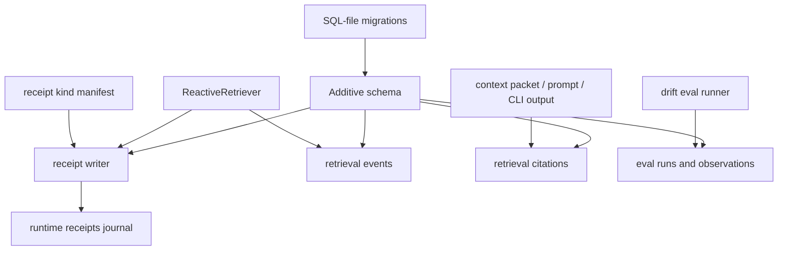
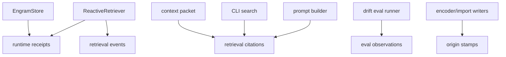

# feat: Add Step 1 instrumentation journals

## Summary

Add Mnemos Step 1 instrumentation as record-only plumbing: runtime receipts, retrieval event/citation logging, retrieval-why receipts, day-one drift eval outputs, and per-engram origin stamps. The implementation uses SQL-file migrations only for additive schema and keeps live `~/.mnemos`, affect computation, reranking, stability writes, and stamp backfill out of scope.

---

## Problem Frame

The Step 1 charter asks the store to remember its own operation before later affect, bond, stamp, and outcome loops can safely use those records. The danger is not missing a table; it is silently turning instrumentation into behavior, mutating memory state while "just logging," or violating the newly merged additive-only migration runner contract.

---

## Assumptions

*This plan was authored without synchronous scope confirmation because David already requested planning followed by execution. The items below are agent inferences that should stay visible during implementation and PR review.*

- `receipt_kinds` should be implemented as a checked-in code manifest rather than seeded SQL rows, because the migration runner forbids DML and the charter allows "one table or manifest."
- The existing `migration_receipts` table remains the migration-runner bootstrap receipt journal; Step 1 adds a separate runtime receipts journal instead of overloading it.
- Retrieval logging will prove the new instrumentation path is non-mutating with reconsolidation disabled, while preserving the pre-existing reconsolidation behavior for normal retrieval.
- "Citations" means a surfaced retrieval result that is actually included in an output surface such as a context packet, prompt builder, or CLI search result, not merely every candidate considered by the retriever.
- Existing rows receive `origin_stamp=NULL` during migration. NULL means pre-instrumentation: absence of a measurement, not a measurement.
- Citation rows written by context packet and prompt surfaces are render-tier rows; CLI search rows are operator-visible. Both are marked not eligible for future cited-vs-ignored fitting; true use citations need a later session-close/reflection channel.
- The charter names an external supervision `reports/` acceptance artifact, while code, tests, and repo-local plan/evidence artifacts belong in this Mnemos branch.

---

## Requirements

- R1. Add the ONE runtime receipts journal with the charter envelope: `receipt_id`, timestamp, actor, runtime, session, engram refs, immediacy, kind, and typed payload.
- R2. Enforce a receipt kind registry seeded with v1 §8 kinds plus `appraisal-verdict` and `stamp-translation`; unregistered kinds fail closed before durable write.
- R3. Keep decisions ledger and identity/vault journal separate; Step 1 receipts must not absorb those appendices.
- R4. Provide no store accessor for updating or deleting receipts; invalid envelopes and malformed payloads are refused before insertion.
- R5. Log every `ReactiveRetriever.retrieve()` call as a retrieval event, and log citations only when surfaced memories are actually used by an output surface.
- R6. Attach retrieval-why data to surfaced memories and mirror that as `retrieval-why` receipts with immediacy carried in the receipt envelope.
- R7. Prove retrieval event logging writes no stability, accessibility, reconsolidation, belief, hypomnema, or other memory scalar state.
- R8. Add day-one drift eval plumbing and instruments for citation mass concentration, category breadth, person/relational share, serendipity recording, retrieval benchmark metrics, latency, and monoculture tripwire scaffolding.
- R9. Register future inactive instruments now so they activate by input availability rather than later code shape: affect entropy, stamp distribution, pride/play share, correction accessibility, H5 fire/drop lines, and H7 bond probes.
- R10. Add an additive `origin_stamp` column for engrams and stamp new write-path engrams as one of user-witnessed, inference, retrieval, or import without conflating it with inferred/experienced or source authority.
- R11. Report producer failure counts to an available surface today, with log output acceptable until morning-packet plumbing exists.
- R12. Verify through virgin/copy stores only; never apply Step 1 migrations to live `~/.mnemos` during this work.

---

## Scope Boundaries

- No affect computation, H5 grader, bond machinery, stamp backfill, reranker fitting, entropy floor, stability writes, wake-packet content, or live LaunchAgent activation.
- No change to existing retrieval ranking, read-visibility filtering, reconsolidation semantics, or context packet ordering except adding instrumentation metadata and citation logging.
- No migration DML/backfill. SQL migrations remain additive-only schema customers of the runner.
- No writes to live `~/.mnemos`; tests and verification use temporary virgin stores or explicit copy stores.
- No use of Riley/upstream git; branch and PR target David's `origin`.

### Deferred to Follow-Up Work

- Actual stability writes from genuine-recall receipts land at the later recall/stability step, not in Step 1.
- Stamp backfill runs after Step 1 and may consume the registered `stamp-translation` kind, but this plan does not build the backfill.
- Morning-packet rendering can later consume producer failure counts; this plan only emits the counts to the current logging surface.

---

## Context & Research

### Relevant Code and Patterns

- `mnemos/store/migration_runner.py` is the additive-only SQL runner. It lints `CREATE TABLE`, `ALTER TABLE ADD COLUMN`, `CREATE INDEX`, and `CREATE VIEW`; it rejects DML, triggers, destructive SQL, and schema_migrations manipulation.
- `mnemos/store/migrations/0011_migration_receipts_journal.sql` is the runner bootstrap receipt table. Step 1 must not conflate it with the runtime receipts journal.
- `mnemos/store/sqlite_store.py` owns store initialization, SQL-file migration application, engram insert/update, read-visibility gates, hypomnema/functional memory helpers, and stats surfaces.
- `mnemos/retrieval/reactive.py` owns retrieval, seed selection, propagation, score breakdown, and existing optional reconsolidation.
- `mnemos/interface/context_packet.py` is the first high-value "actually used" citation surface because it serializes retrieved memories into an agent-readable packet.
- `benchmarks/retrieval_benchmark.py` already seeds synthetic lives and measures precision/recall and drift probes with reconsolidation disabled for measurement.
- `tests/conftest.py` has an autouse live-DB guard that rejects real `~/.mnemos/memory.db`, matching the charter boundary.

### Institutional Learnings

- `docs/solutions/workflow-issues/afferent-membrane-safety-ledger-repair-workflow-2026-07-01.md` shows that safety-ledger work must name exact write/read surfaces and mutation-proof negative tests, not just pass a green local suite.
- `docs/solutions/workflow-issues/pr-merge-readiness-cross-worktree-conflict-check-2026-07-01.md` requires checking active local worktrees before declaring a Mnemos PR merge-safe.

### External References

- No external research used. Local contracts are stronger and more specific than generic observability guidance.

---

## Key Technical Decisions

- Use a manifest for receipt kinds: This satisfies the charter's "table or manifest" registry without violating the runner's no-DML rule, and it keeps kind additions reviewable in code.
- Split runtime receipts from migration receipts: `migration_receipts` is a bootstrap organ for the runner; Step 1 runtime receipts carry actor/runtime/session/immediacy and typed payloads.
- Log retrieval in the retriever but mark citations at output surfaces: the retriever knows what surfaced; context packet, prompt builder, and CLI surfaces know what was actually used.
- Treat retrieval-why as both result metadata and receipt payload: result metadata makes the "why surfaced" available to callers; receipt payload makes it durable and queryable without reranking.
- Preserve existing reconsolidation behavior: Step 1 instrumentation must not weaken current retrieval semantics; non-mutation proof isolates the new logger by disabling reconsolidation in the test.
- Extend the existing benchmark harness rather than build a new evaluator core: the benchmark already owns synthetic corpora and P@k/hot-intrusion measurement.

---

## Open Questions

### Resolved During Planning

- How can the receipt registry be seeded if migrations cannot write rows? Resolve with a code manifest; the charter explicitly permits a manifest.
- Is `migration_receipts` the ONE runtime receipts journal? No. It is the runner bootstrap table; runtime receipts need the full charter envelope.

### Deferred to Implementation

- Exact receipt table and helper names: pick the simplest names that do not collide with `migration_receipts`.
- Exact drift output shape: keep it stable enough for tests and reports, but let implementation reuse the benchmark's natural metric names.
- Exact failure-count log wording: choose concise structured text; tests should assert signal content rather than brittle sentence phrasing.

---

## High-Level Technical Design

> *This illustrates the intended approach and is directional guidance for review, not implementation specification. The implementing agent should treat it as context, not code to reproduce.*

---

## Implementation Units

### U1. Add Step 1 Schema Through SQL Migrations

**Goal:** Add all Step 1 persistence surfaces with additive-only SQL-file migrations.

**Requirements:** R1, R5, R8, R9, R10, R12

**Dependencies:** None

**Files:**
- Create: `mnemos/store/migrations/0012_step1_instrumentation.sql`
- Create: `tests/test_step1_instrumentation_schema.py`
- Modify: `tests/test_migration_runner.py`

**Approach:**
- Add a runtime receipt table with envelope columns and JSON text fields for engram refs and payload.
- Add retrieval event and citation tables, with retrieval events recording cue/scope/result metadata and citation rows linking event/result usage by surface.
- Add drift eval run/observation tables for recorded day-one metrics and inactive future instruments.
- Add nullable `origin_stamp` to `engrams`; write-path stamping lands in U2.
- Treat NULL as a pre-instrumentation marker, not as proof of actual row origin.
- Keep the migration free of DML, triggers, backfills, and transforms so it remains a first-class customer of the runner.

**Execution note:** Add characterization-style tests around the migration runner before broad store integration.

**Patterns to follow:**
- `mnemos/store/migrations/0011_migration_receipts_journal.sql`
- `tests/test_migration_runner.py`
- `tests/conftest.py`

**Test scenarios:**
- Happy path: a virgin temp store migrates through Step 1 and exposes the new tables, indexes, and `engrams.origin_stamp`.
- Edge case: migration plan on a virgin temp store lists Step 1 migration classes without touching schema.
- Error path: a transform/DML statement in a copied Step 1 migration is rejected by the existing migration lint.
- Integration: `EngramStore(tmp_path / "store.db")` applies the shipped SQL migration on bootstrap without touching live `~/.mnemos`.

**Verification:**
- Step 1 schema exists on virgin stores through the normal `EngramStore` bootstrap.
- The migration runner still rejects DML/transforms and duplicate versions.

---

### U2. Implement Receipt Registry, Writer, and Origin Stamping

**Goal:** Add the fail-closed runtime receipt writer and engram origin stamping.

**Requirements:** R1, R2, R3, R4, R6, R10, R11

**Dependencies:** U1

**Files:**
- Create: `mnemos/instrumentation/__init__.py`
- Create: `mnemos/instrumentation/receipt_kinds.py`
- Create: `mnemos/instrumentation/receipts.py`
- Modify: `mnemos/core/engram.py`
- Modify: `mnemos/store/sqlite_store.py`
- Create: `tests/test_step1_receipts.py`
- Modify: `tests/test_encoding.py`
- Modify: `tests/test_u3b_pai_importer.py`

**Approach:**
- Define the canonical receipt-kind manifest with owner spec and payload-schema pointer strings.
- Validate the full envelope before insertion: kind registered, runtime/actor/session fields normalized, engram refs list-shaped, immediacy present, payload serializable and object-shaped.
- Add one append method only. Do not add update/delete receipt helpers.
- Close receipt immediacy to the Step 1 vocabulary instead of allowing free text.
- Stamp new producer engrams at write time using explicit origin where producers know it: importer-created rows to `import`, session observed/user-stated rows to `user-witnessed`, and model-generated/inferred content to `inference`. Keep `retrieval` in the closed vocabulary for future retrieval-origin writers.
- Preserve the distinction between legacy NULL stamps and meaningful write-path stamps; tests should not bless migrated historical rows as provenance-clean.
- Track receipt write failures through a small store-local failure counter or logger hook without failing open.

**Patterns to follow:**
- `mnemos/store/sqlite_store.py` validation helpers and JSON encode/decode patterns
- `mnemos/core/engram.py` constructor validation
- `tests/test_t4_vault.py` mutation-proof negative-test style

**Test scenarios:**
- Happy path: registered kinds append with the full envelope and payload, and the stored row round-trips through a read helper.
- Edge case: empty engram refs are accepted as `[]`, but non-list refs are rejected before insertion.
- Error path: unregistered kind is refused and no receipt row is written; registering the kind in the manifest makes the same append succeed.
- Error path: malformed envelope missing immediacy or runtime is refused before durable write.
- Error path: `EngramStore` exposes no update/delete receipt accessor.
- Integration: new engrams saved through encoder/import/direct stamped call sites receive the expected `origin_stamp` without changing source authority semantics.

**Verification:**
- Receipt writes are append-only through public store APIs.
- Origin stamps exist for newly written engrams and remain orthogonal to source authority.

---

### U3. Log Retrieval Events, Citations, and Retrieval-Why Receipts

**Goal:** Instrument retrieval and output surfaces without changing ranking or memory state.

**Requirements:** R5, R6, R7, R11

**Dependencies:** U1, U2

**Files:**
- Modify: `mnemos/retrieval/reactive.py`
- Modify: `mnemos/interface/context_packet.py`
- Modify: `mnemos/cli.py`
- Create: `tests/test_step1_retrieval_logging.py`
- Modify: `tests/test_retrieval.py`
- Modify: `tests/test_context_packet.py`
- Modify: `tests/test_cli_simple.py`

**Approach:**
- Add retrieval event creation at the start/end of `ReactiveRetriever.retrieve()`, including no-result calls.
- Attach event id and why metadata to each `RetrievalResult`; why includes seed/resonance path, activation score, seed status, read visibility, and confidence-floor filtering context that is already known at retrieval time.
- Append one `retrieval-why` receipt per surfaced result, not per hidden candidate.
- Mark citations from context packets when a retrieved engram is serialized into `mnemos_engrams`; mark CLI search citations when search prints a result.
- Keep logger failures visible through producer failure counts, but do not let instrumentation partial writes mutate ranking or scalar memory state.

**Execution note:** Implement the non-mutation regression test before adding retrieval logging.

**Patterns to follow:**
- `mnemos/retrieval/reactive.py`
- `mnemos/interface/context_packet.py`
- `tests/test_retrieval.py`
- `tests/test_context_packet.py`

**Test scenarios:**
- Happy path: a retrieval that returns two operational engrams writes one retrieval event, two retrieval-why receipts, and result metadata containing event id and why.
- Happy path: building a context packet marks citations only for retrieved engrams included in the packet.
- Edge case: an empty retrieval writes a retrieval event with zero surfaced ids and no citations.
- Error path: receipt logger failure records a producer failure count/log signal and does not alter retrieval results.
- Integration: with reconsolidation disabled, retrieval logging does not change engram stability, accessibility, last-accessed, reconsolidation count, beliefs, or hypomnema rows.
- Integration: review/audit-only rows remain excluded from operational retrieval logging and citation surfaces under existing read-visibility tests.

**Verification:**
- Every `ReactiveRetriever.retrieve()` call has a retrieval event row.
- Citation rows require actual output usage.
- Step 1 logging has a focused no-scalar-mutation proof.

---

### U4. Add Drift Eval Plumbing and Day-One Instruments

**Goal:** Add a day-one eval runner that records metrics without enforcing policy.

**Requirements:** R8, R9, R11, R12

**Dependencies:** U1, U2, U3

**Files:**
- Create: `mnemos/instrumentation/drift_eval.py`
- Modify: `benchmarks/retrieval_benchmark.py`
- Modify: `mnemos/cli.py`
- Create: `tests/test_step1_drift_eval.py`

**Approach:**
- Define instrument registry entries with active/inactive state and required input labels.
- Register day-one active instruments from available retrieval event, citation, operator annotation, and benchmark inputs; Step 1 records the registry and benchmark metrics, while input-specific reducers remain later work.
- Record serendipity as a metric line only; do not enforce or alarm on it.
- Register inactive future instruments and return inactive/skipped status when inputs are unavailable.
- Store eval runs and observations in Step 1 tables and expose a CLI command that can run on an explicit temp/copy DB.

**Patterns to follow:**
- `benchmarks/retrieval_benchmark.py`
- `tests/test_rm7_affect_recency_paging.py`
- `mnemos/cli.py` subcommand organization

**Test scenarios:**
- Happy path: the CLI registers the day-one and future instrument manifest against an injected temp DB path.
- Happy path: benchmark precision/recall metrics persist as drift-eval runs and observations.
- Error path: inactive future instruments are registered inactive rather than failing or enforcing policy.
- Integration: CLI drift eval refuses default live DB paths unless the explicit live override is supplied.

**Verification:**
- Day-one registry rows and benchmark metric observations persist on temp/copy stores.
- Registered inactive instruments stay silent without erroring.

---

### U5. Surface Producer Failure Counts

**Goal:** Make instrumentation producer failures visible until morning-packet plumbing exists.

**Requirements:** R11

**Dependencies:** U2, U3, U4

**Files:**
- Modify: `mnemos/instrumentation/receipts.py`
- Modify: `mnemos/instrumentation/drift_eval.py`
- Modify: `mnemos/cli.py`
- Cover in: `tests/test_step1_receipts.py`

**Approach:**
- Centralize producer failure recording so receipt, retrieval, citation, and drift producers can increment counts with producer names and failure classes.
- Persist per-producer counts in the store and expose the aggregate through `get_stats()` / `mnemos stats`.
- Keep producer failure visibility separate from receipt payload semantics; a failed receipt write should not forge a successful receipt.

**Patterns to follow:**
- `mnemos/store/migration_runner.py` loud abort messages
- `tests/test_u3c_pai_review_gate.py` string-signal assertions

**Test scenarios:**
- Happy path: a fresh DB reports zero instrumentation failures.
- Error path: repeated producer failures increment the named durable counter without leaking across DBs.
- Integration: retrieval event rows include the current aggregate failure count.

**Verification:**
- Producer failures are visible from store stats / CLI stats and are not silently swallowed.

---

### U6. Record Evidence and Acceptance Report

**Goal:** Produce the charter-required evidence report and keep PR review anchored to acceptance proof.

**Requirements:** R7, R8, R12

**Dependencies:** U1, U2, U3, U4, U5

**Files:**
- Create: `docs/step1-instrumentation-evidence.md`
- External artifact named by charter: supervision report in `reports/` (outside the repo-local implementation artifact)

**Approach:**
- Record what shipped, focused acceptance commands, mutation-proof notes, and any spec ambiguity found during implementation.
- Keep repo-local evidence in docs for PR review; external supervision reporting stays outside the repo-local implementation artifact.
- Include the explicit reconciliation of runtime receipts vs. `migration_receipts`, and manifest registry vs. SQL seed rows.

**Patterns to follow:**
- `docs/u3c-step3-launch-gate.md`
- `docs/solutions/workflow-issues/afferent-membrane-safety-ledger-repair-workflow-2026-07-01.md`

**Test scenarios:**
- Test expectation: none -- documentation/evidence unit. Verification is artifact presence and accurate command/output capture after implementation.

**Verification:**
- Evidence doc names shipped code, tests, acceptance results, and PR link.
- Repo-local evidence exists and names any external-report boundary explicitly.

---

## System-Wide Impact

- **Interaction graph:** Store initialization applies additive migrations; engram writes stamp origin; retriever writes events/why receipts; packet/prompt/CLI surfaces mark citations; drift eval records registry rows and benchmark observations.
- **Error propagation:** Invalid receipts fail before durable write; migration lint remains the first schema gate; producer failure counts expose instrumentation failures without pretending a receipt exists.
- **State lifecycle risks:** Retrieval instrumentation must not create stability writes; citation rows should be append-only and tied to retrieval events; drift eval observations are records, not policy actions.
- **API surface parity:** Context packet, prompt builder, and CLI search cite surfaced results; other future output surfaces can call the same citation helper.
- **Integration coverage:** Store bootstrap + retriever + context packet tests prove cross-layer behavior better than isolated helper tests.
- **Unchanged invariants:** Read-visibility filtering remains fail-closed; decisions/vault journals remain separate; existing reconsolidation behavior remains controlled by `reconsolidation_enabled`.

---

## Risks & Dependencies

| Risk | Mitigation |
|------|------------|
| Runtime receipts accidentally reuse `migration_receipts` and lose the charter envelope | Use a separate runtime receipt table and document the split in evidence |
| Registry seeding conflicts with no-DML migrations | Use a manifest registry and test unregistered-kind refusal |
| Retrieval logging mutates memory state | Add focused non-mutation tests with reconsolidation disabled |
| Citation logging overcounts candidates as used memories | Mark citations only from output surfaces that actually serialize/print results |
| Drift eval becomes enforcement too early | Persist observations and inactive/skipped state only; no policy gates or alarms |
| Migrated `origin_stamp` NULLs are mistaken for real provenance | Document and test that NULL means pre-instrumentation, not a measured stamp |
| Active local soak branch conflicts with Step 1 PR | Before PR handoff, inspect active worktrees and use `git merge-tree` where appropriate |

---

## Documentation / Operational Notes

- Run focused tests for schema, receipts, retrieval logging, drift eval, and failure-count behavior before the full suite.
- Run `ruff` if available through the repo's configured environment; otherwise record the absence clearly.
- Do not run `mnemos migrate apply` against the default live database. Verification uses temp DBs through pytest and explicit environment injection.
- Use `gh-axi` for GitHub PR operations.

---

## Sources & References

- Origin document: external Step 1 instrumentation charter supplied by David.
- Related code: `mnemos/store/migration_runner.py`
- Related code: `mnemos/store/migrations/0011_migration_receipts_journal.sql`
- Related code: `mnemos/store/sqlite_store.py`
- Related code: `mnemos/retrieval/reactive.py`
- Related code: `mnemos/interface/context_packet.py`
- Related code: `benchmarks/retrieval_benchmark.py`
- Related tests: `tests/test_migration_runner.py`
- Related tests: `tests/test_retrieval.py`
- Related tests: `tests/test_context_packet.py`
- Related learning: `docs/solutions/workflow-issues/afferent-membrane-safety-ledger-repair-workflow-2026-07-01.md`
- Related learning: `docs/solutions/workflow-issues/pr-merge-readiness-cross-worktree-conflict-check-2026-07-01.md`
