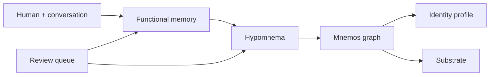

# Turnkey Mnemos Memory System

This is the single-agent path for Mnemos. Multi-agent/shared-memory design is a separate track.

## What The Agent Gets

Mnemos gives an agent four cooperating surfaces:

1. **Functional memory**: current task state, active corrections, commitments, preferences, and open questions.
2. **Hypomnema**: durable scoped continuity for one human/project/agent relationship, still easy to revise.
3. **Mnemos graph**: long-term engrams, connections, beliefs, decay, and reconsolidation.
4. **Visibility**: operational context packets, review queues, health cards, recall, and optional SVG identity graphs.

## Default Session Loop

At the beginning of a meaningful session:

```text
mnemos_context
mnemos_introduce, if Mnemos asks for the agent's model/name
```

During the session:

```text
mnemos_capture for stable preferences, decisions, project state, workflows, and corrections
mnemos_recall before relying on prior-session memory
mnemos_correct when remembered continuity is stale, wrong, superseded, or should be forgotten
```

When the human asks to inspect memory:

```text
mnemos_health
mnemos_context with include_graph=true, when the client can display visual artifacts
```

For explicit admin workflows, start advanced mode with `mnemos serve --mode
advanced`; that surface still exposes direct functional-memory, hypomnema,
belief, inspect, proposal-audit, and consolidate tools. Scope-taking advanced
tools inherit the server's configured agent/person/project scope when their
scope args are left at defaults. Advanced direct capture tools
(`mnemos_remember`, `mnemos_ingest`) require an explicit `kind`: `episodic`,
`semantic`, `procedural`, or `prospective`.

Simple mode handles functional memory, hypomnema, and long-term promotion
internally so the agent does not have to choose storage layers during normal
conversation. Operational packets and recall use only `operational_context`
rows; pending confirmation prose and promotion-candidate prose surface as
review counts and source IDs until an explicit review surface asks for them.
Simple captures that look like identity/foundational or otherwise
promotion-ready material are held as review-only continuity rather than being
promoted into operational engrams.
The agent also does not stamp source authority; Mnemos derives authority from
the tool/import/producer channel and treats payload authority claims as text.
Step 1 origin stamps are internal provenance measurements, not caller-supplied
authority; legacy `NULL` stamps mean no measurement existed yet.

Gated inner-life and soak rows are outside the turnkey session loop. Their
private provenance, gate decisions, skips/drops, and tick telemetry live in
`inner_life_events`; any passed generated reflection, wandering, or dream
memory is private `audit_only` low-stakes memory and does not enter ordinary
context or recall.

DynamicModulation rows are also outside the turnkey session loop. Schema v10
can store bounded, rollout-tagged, non-evidentiary modulation records, but they
are inert: ordinary context, recall, identity, substrate, and MCP tools do not
read or apply them. U6b `ExperienceTick` is proposal-only; it can emit
review-visible proposal rows targeting the modulation surface, but it does not
write modulation rows or activate retrieval influence.

Step 1 instrumentation is internal and record-only. Context, prompt, and recall
paths may write retrieval events, retrieval-why receipts, and citation rows in
the local store, but those records do not change what gets retrieved or shown.

Beliefs in ordinary operating context render with a launch-minimal challenge
line: `under-challenge`, `revised-down (YYYY-MM-DD)`, or `never-challenged`.
That line is state for orientation, not authority to rewrite the belief.
Automatic encoder/classifier/reflection evidence can create surprise, edges,
and bookkeeping, but belief confidence moves only through explicit pending
review, correction, seeding, or restore authority.

## Onboarding Walkthrough

The agent should walk the human through:

1. Agent name and role.
2. Human/person scope.
3. Important starting context and boundaries.
4. Active projects.
5. Optional import path for prior notes or transcripts.
6. Whether the substrate should run in the background.
7. Optional LLM provider for richer memory processing.

The onboarding ritual seeds:

- foundational hypomnema about the relationship
- active functional memory for onboarding
- initial Mnemos engrams and beliefs

## Memory Rules

- Use functional memory before hypomnema when context is still in motion.
- Use hypomnema before Mnemos when continuity is personal, scoped, or likely to be corrected.
- Mark inferred memory as needing confirmation.
- Revise hypomnema instead of overwriting it.
- Promote to Mnemos only after continuity is stable, salient, and useful beyond the current relationship scope.
- Treat review-only material as a queue, not as operating context; use review
  mode or the review queue when a human/operator needs to inspect the prose.
- Treat a simple-mode `Captured continuity for review` response as pending:
  ordinary context, recall, and cross-session verification must not quote its
  prose.
- Treat belief `under-challenge` as pending review state. Do not treat it as a
  settled contradiction unless an explicit review/correction surface resolves
  the belief.
- Do not treat a caller domain label as a downgrade. Mnemos can store the
  higher-risk effective domain, route underclaimed high-blast continuity to
  review, and collapse duplicate scoped claims.

## Inline Visual Content

`mnemos_context(include_graph=true)` returns the normal continuity packet plus
an SVG identity graph artifact and structured graph data:



This lets visual-capable clients show the human what the memory system is doing
inside the same chat session, without requiring a separate dashboard. Advanced
mode still has `mnemos_visual_snapshot` for Markdown/Mermaid inspection.
